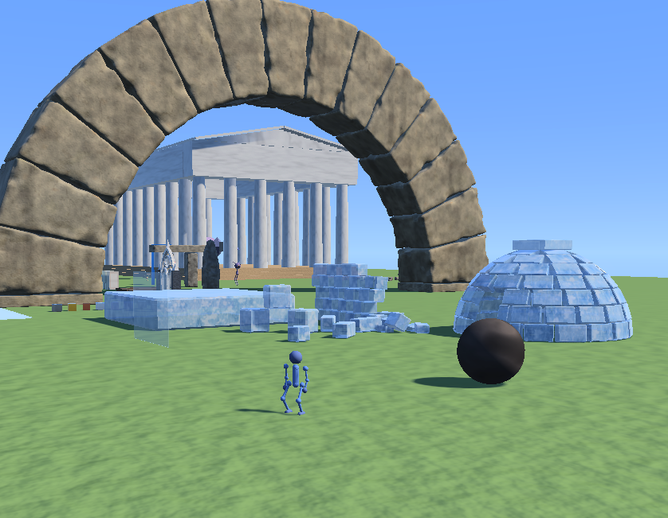

# Voxel Phase

A 3D game engine in Rust and Vulkan, built around destructible voxel terrain. It
has its own rigid-body physics engine, procedural character animation, water
simulated as a hydrological network, fracturing glass and ice, and a GPU fluid
simulation for fire.



It is developed on macOS through MoltenVK. Linux and Windows have not been
tried.

## Building

You need:

- **Rust**, stable, via [rustup](https://rustup.rs).
- **The Vulkan SDK**, from [LunarG](https://vulkan.lunarg.com/sdk/home). The
  build compiles the GLSL shaders with its `glslc`. On macOS it also provides
  the Vulkan loader and MoltenVK the game runs on.

The simplest setup is to source the SDK's environment script in the shell you
build and run from:

```bash
source ~/VulkanSDK/<version>/setup-env.sh
cargo run --release
```

That sets `VULKAN_SDK`, which is where the build looks for `glslc`, and puts the
loader and MoltenVK where the game finds them at runtime. `glslc` can also be
put on `PATH`, or named directly with `GLSLC=/path/to/glslc`.

To avoid sourcing the script every time, put the same variables in a
machine-local `.cargo/config.toml`:

```toml
[env]
VULKAN_SDK = "/Users/you/VulkanSDK/<version>/macOS"
DYLD_FALLBACK_LIBRARY_PATH = "/Users/you/VulkanSDK/<version>/macOS/lib"
VK_ICD_FILENAMES = "/Users/you/VulkanSDK/<version>/macOS/share/vulkan/icd.d/MoltenVK_icd.json"
VK_LAYER_PATH = "/Users/you/VulkanSDK/<version>/macOS/share/vulkan/explicit_layer.d"
```

## Running

```bash
cargo run --release                                   # levels/test_arena.level.ron
cargo run --release -- levels/wrecking_yard.level.ron # any level in levels/
```

| Input | Action |
|---|---|
| W A S D / arrow keys | Move |
| Space | Jump |
| Left Shift | Sprint |
| Left Ctrl | Crouch |
| Q / E | Zoom in / out |
| Left mouse | Throw a grenade |
| Right mouse (hold) | Grab an object |
| Esc | Release the mouse |
| F3 | Print the debug log (physics, render and system timings) to stdout |

## Tools

Most subsystems have a headless tool for looking at or measuring them without
playing. Their options are documented at the top of each source file in
`src/bin/`.

| Binary | What it is for |
|---|---|
| `level_check` | Validates a level offline and exports an SVG schematic |
| `level_viewer` | Renders a level to a PNG contact sheet |
| `visual_bench` | Renders material and prop scenes to a PNG contact sheet |
| `bench_viewer` | Physics test scenarios in a window |
| `anim_viewer` | Character gait, measured and drawn as a filmstrip |
| `character_viewer` | The real game, headless, with a scripted player |
| `water_viewer` | Scripted water scenarios, measured and drawn |
| `physics_perf`, `terrain_perf`, `render_perf`, `water_perf` | Where a frame's time goes |

```bash
cargo run --bin level_viewer -- levels/subsidence.level.ron
cargo run --release --bin physics_perf
```

## Tests

```bash
cargo test                                         # unit tests
cargo test --release --features bench_harness      # plus the physics scenarios
```

## Layout

The design notes behind most subsystems are in [`docs/`](docs).

| Path | Contents |
|---|---|
| `src/physics/` | Rigid bodies, narrowphase, constraint solver, CCD |
| `src/terrain/` | Sparse voxel octree, marching-cubes meshing, destruction |
| `src/water/` | Hydrology: basins, reaches and falls, solved as a network |
| `src/animation/` | Procedural humanoid animation and foot placement |
| `src/rendering/` | Vulkan renderer, post-processing, profiling |
| `src/app/` | ECS wiring and the library of spawnable objects |
| `shader/` | GLSL, compiled to SPIR-V by `build.rs` |
| `levels/` | Levels, in RON |

## License

Licensed under either of

- Apache License, Version 2.0 ([LICENSE-APACHE](LICENSE-APACHE))
- MIT license ([LICENSE-MIT](LICENSE-MIT))

at your option.

Unless you explicitly state otherwise, any contribution intentionally submitted
for inclusion in the work by you, as defined in the Apache-2.0 license, shall be
dual licensed as above, without any additional terms or conditions.

The JetBrains Mono font in `assets/fonts/` is licensed separately under the SIL
Open Font License 1.1; see [`assets/fonts/OFL.txt`](assets/fonts/OFL.txt).
