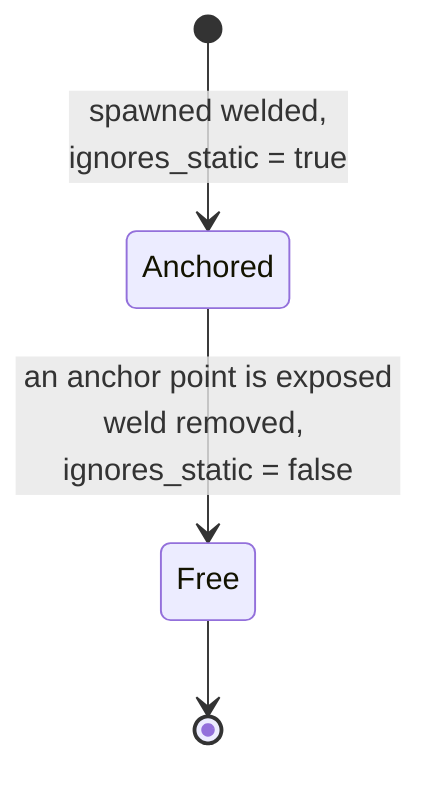
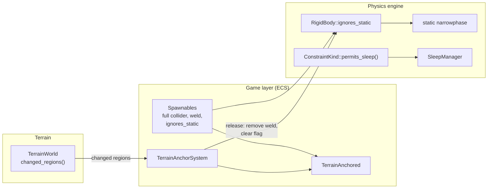

# Terrain Bedding Design

How a body meant to sit partly inside the terrain rests there without fighting
it, sleeps, and comes free when the ground under it is destroyed.

Status: stage 1 (physics) built; stage 2 (spawnables) not started.

## 1. The problem

Some bodies are authored partly inside the terrain on purpose. Each is a
dynamic body held by a rigid `world_fixed` weld, and `TerrainAnchorSystem`
releases it when its ground is gone:

| Body | Buried | How its collider avoids the ground today |
|---|---|---|
| Menhir | bottom 20% | full egg shifted up by half the buried depth — it doesn't avoid it |
| Fence post | foot | shortened capsule |
| Rock | 30% of its height | hull trimmed at the highest ground under it (`rock::above_ground`) |
| Seesaw, pendulum, play wheel | base or frame | welded, `TerrainAnchored` |

What goes wrong:

1. **The anchored collider must stay clear of the ground.** Each spawnable
   finds its own way to keep it clear, and one got it wrong: the menhir's
   collider overlaps the ground. The contact pushes the body out and the weld
   holds it in. It rises about 0.1 m and keeps a phantom 5 m/s velocity forever.
2. **A welded body never sleeps.** The sleep manager keeps every constrained
   body awake (`has_active_constraint`), so a woken menhir costs a solve every
   frame for the rest of the level.
3. **Release is polled every frame.** Each anchor point casts a ray every
   frame, even when no terrain has changed. The test arena's rockery alone
   casts 100 per frame.

## 2. The idea

**While a body is welded to the world, it doesn't touch the terrain.**

A rigid weld to the world holds the body completely, so its terrain contacts
can do nothing useful: neither side can move, and each contact is either
inactive or fighting the weld. Once it has no terrain contacts, a bedded body
no longer needs a collider shaped to stay clear of the ground. It keeps its
full collider the whole time. When its ground goes, the weld is removed and the
terrain contacts come back.



| | Weld | Terrain contacts | Sleep |
|---|---|---|---|
| Anchored | rigid, to world | none | allowed |
| Free | none | normal | normal rules |

At release, the full collider may still overlap ground that wasn't destroyed.
That's what today's collider swap does already. NGS moves the body out without
giving it any velocity, so it stops at the surface instead of flying off. It
does move out quickly: `deep_correction_speed` caps each contact's correction
in each iteration, not the body's, so a body with four contacts can move up to
about 24 m/s. The bench block (0.2 m buried) snaps out in about one frame. A
blast usually hides that; §6 covers a gentler release if play shows otherwise.

## 3. Components



### 3.1 Physics: `ignores_static`

A per-body flag: when it's set, the body gets no contacts with static geometry.

- It lives on `RigidBody`. It's set at spawn with
  `RigidBodyDesc::ignores_static(true)`, and changed afterwards with
  `PhysicsWorld::set_ignores_static(handle, bool)`.
- `generate_static_contacts` skips flagged bodies, next to where it already
  skips sleeping ones (`static_contacts.rs:46`). Static CCD skips them too.
- It's a general physics feature and names nothing about terrain. The game
  decides when a body ignores static geometry; physics only honours it.

### 3.2 Physics: `ConstraintKind::permits_sleep`

This lets a welded body sleep.

```rust
impl ConstraintKind {
    /// Whether the bodies this holds may sleep while it is active. A
    /// constraint that ties a body to the world and nothing else cannot be
    /// disturbed by another body's motion through it.
    pub fn permits_sleep(&self) -> bool { ... }
}
```

- A `Fixed`, `BallJoint` or `Hinge` anchored to the world returns `true`.
  Two-body constraints and drives return `false` until the sleep manager builds
  islands across constraints (see its existing note at `manager.rs:233`).
- `has_active_constraint` becomes "has an active constraint that doesn't
  permit sleep". Each constraint kind declares its own policy, instead of the
  manager deciding for every kind.
- Waking still works as it does now: whatever touches the body wakes it.

### 3.3 Game: `TerrainAnchored` and `TerrainAnchorSystem`

Both stay, with less in them:

- **`released_collider` goes.** Release clears `ignores_static` instead of
  swapping colliders.
- **The system returns early when `TerrainWorld::changed_regions()` is
  empty**, which it is on almost every frame. When it isn't empty, the system
  checks only the anchors inside a changed region. Water already uses the same
  signal.
- The release rule itself doesn't change: the body comes free when any anchor
  point is exposed.

### 3.4 Spawnables

The menhir, fence post, rock, seesaw, pendulum and play wheel attach their full
collider and set `ignores_static`. This deletes:
- `rock::above_ground` and its tests;
- the menhir's collider offset;
- the post's shortened capsule;
- every anchored/released collider pair.

If the six spawnables end up with near-identical anchoring code, it moves into
one helper.

## 4. SOLID check

- **`ignores_static`.**
  - Single responsibility: it holds one fact about a body.
  - Dependency direction: physics depends on nothing in the game or terrain.
  - The one concern is that `RigidBody` gains another field. A side table on
    `PhysicsWorld` would add a lookup to a loop that already reads per-body
    flags (`is_static`, sleeping), and it wouldn't separate anything.
- **`permits_sleep`.** Open/closed: a new constraint kind declares its own
  sleep policy, and the sleep manager doesn't change. Today the manager decides
  for every kind.
- **`TerrainAnchored`.** Single responsibility: it loses the collider swap, one
  of its three reasons to change. The released-model swap (only the pendulum's
  rope) stays for now; see §6.
- **`TerrainAnchorSystem`.** Unchanged in shape. It reads `changed_regions()`
  from `TerrainWorld` directly, as water does. A trait with one implementation
  wouldn't buy anything.

## 5. Plan

1. **Physics.** Add `ignores_static` and `permits_sleep`, with bench tests:
   - a box half-buried in a flat floor and welded, with the flag set, shows zero
     velocity and sleeps within a second;
   - a ball dropped on it wakes it;
   - a released box comes out of the floor with no velocity and no overshoot,
     and ends resting on it.
2. **Game.** Migrate the six spawnables, cut `released_collider`, and gate
   `TerrainAnchorSystem` on `changed_regions()`. The check is the rest lint:
   menhirs gone from it, nothing new in it.

## 6. Later: exhuming as gameplay

This needs design of its own when buried objects become a feature. Here is
what the idea above leaves room for.

- **Gradual release.** Replace "an anchor point is exposed" with the fraction
  of the body still in solid. Sample points in the body's frame, read with
  `is_solid_at`, which unlike ray casts is correct under overhangs. It could
  release below some fraction of the initial hold.
- **Grip that scales with exposure.** Set the weld's `max_impulse` in
  proportion to that fraction, so the grab system can pull a half-dug object
  free.
- **A gentler release.** If snapping out of leftover ground looks wrong in
  play, cap push-out per body (not per contact) while it emerges.
- **Release reactions.** Swap the model, raise dust, tick an objective. If
  these multiply, move them out of `TerrainAnchorSystem` onto a marker
  component that each reaction joins on.

Considered and set aside:

- **A per-column "bedding line" contact filter.** It isn't needed while the
  weld holds, and it would have filtered after manifold reduction.
- **Carving a socket in the terrain.** It's too coarse at 1–2 m voxels.
- **Making bedded bodies static instead of welding them.** It loses breakable
  anchors and the weld behaviour the seesaw, pendulum and play wheel frames rely
  on.
