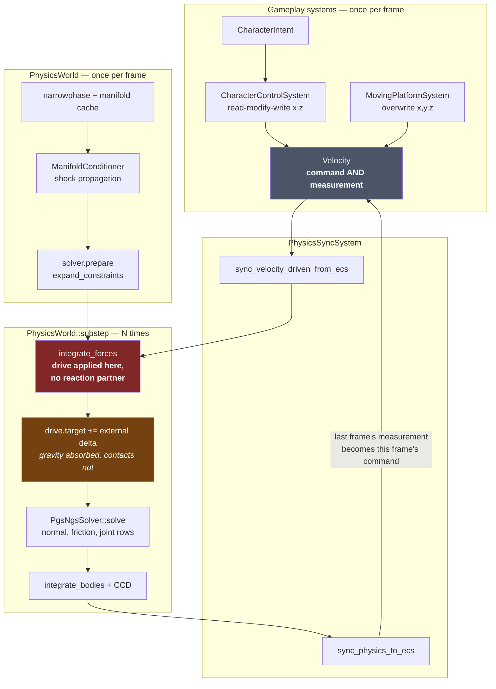
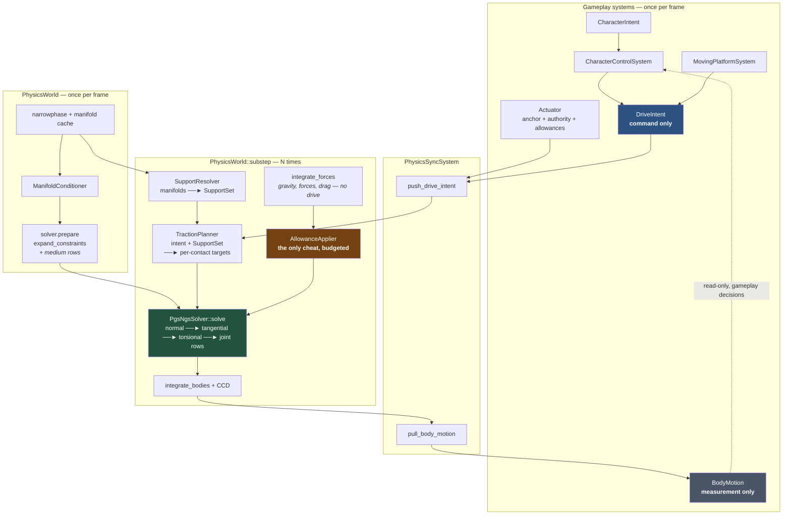
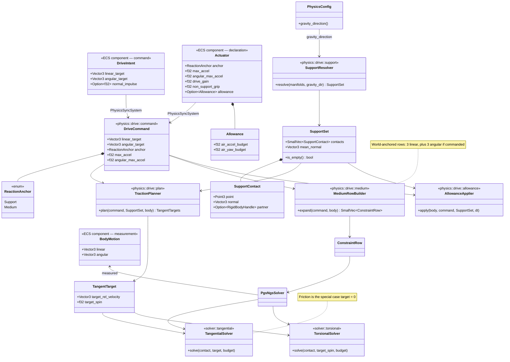
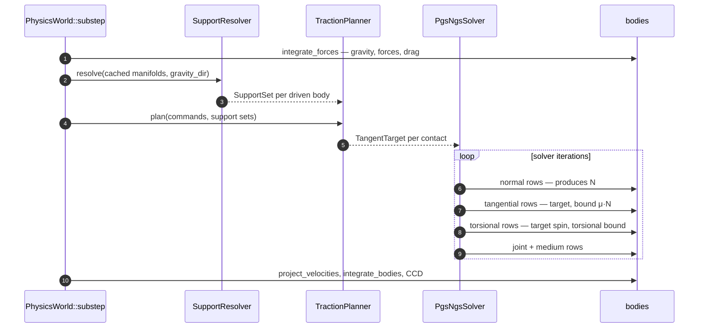

# Traction Drive — Design

Design for the mechanism that replaces `VelocityDriven`. The requirements it
must satisfy are R1–R12 in
[`VELOCITY_DRIVE_AND_PLATFORMS.md`](VELOCITY_DRIVE_AND_PLATFORMS.md) §7; that
document also records why the present mechanism behaves as it does. This one
does not repeat the diagnosis. It answers a single question:

> Where does a character's momentum come from, and what is on the other end of
> it?

**The design in one sentence:** a drive is friction with a non-zero target.

Everything below follows from that. The engine already solves, per contact, a
tangential impulse that drives relative tangential velocity to zero under a
`μ·N` bound. A walking character wants the same impulse at the same point under
the same bound, driving relative tangential velocity to *five metres per second*
instead of zero. There is no second mechanism to build — there is one parameter
to unhard-code, and a command channel to feed it.

That thesis is about the *form* of the row. It says nothing about the
*magnitudes* the row produces against this project's tuning, and those decide
how the change feels rather than whether it is correct. §10 and §11 carry that
half. Both of the decisions there are settled — the character is a cartoon by
measured decision, and grounding has one source with a named allowance for what
that still strands. §11 records each with the alternatives it was chosen over,
because both are questions about how the game should feel rather than about
whether the mechanism is correct.

---

## 1. Terms

Every term coined by this design, defined before use. Terms already in the
codebase are marked *(existing)*.

| Term | Definition |
|---|---|
| **Drive Intent** | The command channel. What gameplay *wants*: a target velocity expressed relative to a reaction anchor, plus a target angular velocity. Write-only from gameplay's side, never read back. |
| **Body Motion** | The measurement channel. What the body *did*: linear and angular velocity as measured by the engine after solving. Read-only from gameplay's side. Replaces the read-modify-write role of today's `Velocity` *(existing)*. |
| **Actuator** | The per-entity declaration of *how* a body converts intent into momentum: which reaction anchor it uses, how much authority it has, how it grips a surface it is not standing on, and which allowances it is granted. A property of the entity, not a branch in the engine. |
| **Reaction Anchor** | The declared recipient of every equal-and-opposite impulse a drive applies. Exactly two kinds exist: **Support Anchor** and **Medium Anchor**. |
| **Support Anchor** | Reaction goes into the bodies the driven body is resting on, at the contact points. A character. Produces the correct torque on a platform by construction. |
| **Medium Anchor** | Reaction goes into the world — an infinite reservoir. A thruster, a rotor, a magnetically levitated lift. Honest but explicitly declared: the entity states that it burns an inexhaustible fuel. |
| **Support Set** | Per body, per frame: the supporting contacts, each with its contact point, normal and partner body. Derived from the manifolds the narrowphase already produced. Generalises today's `GroundingDetector` *(existing)*. Carries no weights — see §6.1 on why load distribution needs none. |
| **Contact Frame** | The orthonormal basis at a contact: the normal plus two tangents. The only basis any drive code is permitted to use. |
| **Target Relative Velocity** | The tangential relative velocity the drive asks for at one contact point, computed from the Drive Intent and the driven body's rigid-body kinematics. Zero is ordinary friction. |
| **Tangential Row** | The unified contact row that solves toward a Target Relative Velocity under the traction budget. Today's friction solve is the special case where the target is zero. |
| **Torsional Row** | The same idea about the contact normal: drives relative spin toward a target under a torsional budget. This is how a character turns. |
| **Traction Budget** | The impulse bound on a contact's tangential row, `μ_drive·N`. One budget, shared: a body spending it on drive has none left for grip. Its magnitude is set by the Drive Gain — §11. |
| **Drive Gain** | The per-actuator factor separating the drive's `μ_drive` from the contact's grip `μ`. Default 1.0; **the player is 5.0** (§11). It is not a coefficient of friction and does not model one — no friction formulation supplies this factor, and §11 works through why. It is the dial for how cartoon a character's acceleration is, and it is the design's second sanctioned cheat alongside **Allowance**: deliberate, named, confined to one scalar, and instrumented (§11). |
| **Non-Support Grip** | The per-actuator factor scaling this body's own tangential budget at contacts that are **not** in its Support Set. Default 1.0. The player sets it near zero so jumps along vertical surfaces are not grabbed. Successor to `FrictionModel::AxisBiased` *(existing)* — §6.7. |
| **Normal Impulse Command** | The command-channel entry for a jump: an impulse along the support normal, delivered through the Support Set so the reaction lands on whatever is being jumped off. §6.3. |
| **Allowance** | A named, bounded, opt-in, non-conservative authority. Lives in exactly one module with an explicit per-entity budget. The design's only sanctioned cheat (R8). Its scope is much larger than "edge case": an airborne body has *zero* drive authority, ground yaw needs one (§6.2), and an unsupported jump needs one (§6.3) — so allowances cover the whole jump arc, most of turning, and one of the two ways a jump starts. Two shapes are needed, not one: an **impulse** budget, and a **projection** budget that scales or clamps velocity along an axis (jump cutoff is `v *= factor`, which no fixed impulse can express — §6.3). |
| **Effort** | *Deferred (see requirements §8).* A named authority that biases the drive to compensate for slope. Not designed here; the architecture leaves a seam for it. |

---

## 2. Existing architecture — engine level

What runs today, per frame.



Two structural faults, both visible in the diagram:

1. **The feedback edge** `Up ──► Vel`. There is one channel for two jobs, so a
   gameplay write is an edit to a measurement, and correctness depends on which
   axes each writer leaves alone (R5).
2. **`IF` has no outgoing momentum edge.** The drive is applied inside force
   integration, upstream of the solver, to one body. Nothing receives the
   reaction (R1), nothing bounds it (R7), and the solver's contact impulses land
   afterwards where the target shift can no longer see them.

## 3. Proposed architecture — engine level



What changed:

- **The feedback edge is gone.** `DriveIntent` flows down, `BodyMotion` flows
  up, and the dotted edge back into `CharacterControlSystem` carries
  *decisions* (am I falling? how fast am I going?), never a value that is edited
  and returned. R5.
- **The drive moved from `integrate_forces` into the solver.** It is now an
  impulse exchange between two bodies at a contact point, subject to the same
  bounds and the same iteration as every other contact impulse. R1, R2, R7, R9,
  R10 are properties of *where the code lives*, not of what it computes.
- **`integrate_forces` no longer knows what a drive is.** The whole
  target-shift dance at `body.rs:451–460` exists to stop a pre-solve drive from
  fighting gravity. A drive solved alongside gravity's velocity does not need
  it. Deleted.
- **One box is coloured as a cheat.** `AllowanceApplier` is the single place
  non-conservative authority may be applied, and it is empty unless an entity's
  `Actuator` declares a budget. R8.

---

## 4. Existing architecture — component level


Four places in `src/physics/` know a body is driven (`RigidBody::velocity_drive`,
the target shift, the warm-start persistence rule, the restitution suppression),
plus `integrate_forces` itself, plus the leak into `water/coupling.rs`. That is
the surface R11 caps.

## 5. Proposed architecture — component level



---

## 6. How it works

### 6.1 The tangential row

The whole design turns on one generalisation. Today, `solve_friction_impulse`
computes, for each contact:

```
Δλ = −(v_rel · t) / m_eff        bounded by  |λ| ≤ μ·N
```

The `−(v_rel · t)` is a target of zero, hard-coded by omission. The tangential
row makes it explicit:

```
Δλ = ((v_target − v_rel) · t) / m_eff     bounded by  |λ| ≤ μ·N
```

`v_target` is the Target Relative Velocity — what the drive wants the *relative*
motion at this contact to be. Friction is `v_target = 0`, unchanged in
behaviour and unchanged in cost.

The consequences are not incremental; they are the requirements:

| Because the row is… | We get |
|---|---|
| an impulse applied through `apply_impulse_pair` at the contact point | **R1** conservation, with the correct torque arm — walking `+X` at the `+Z` edge torques the platform `−Y`, because that is where the impulse lands |
| applied to a partner whose `inv_mass` is 0 when static or kinematic | **R2** silent absorption *as a mechanism*, with no code path of its own. R2's further claim that the player then accelerates "exactly as today" is not delivered by the row and is not achievable as worded; the magnitude is restored deliberately by the Drive Gain instead — §11 |
| expressed in **relative** velocity, per contact | **R4** support-relative targets — but *per contact*, not per body. See below: a body bridging two supports has no single anchor frame, and its world speed becomes an emergent outcome rather than a commanded one |
| bounded by `μ_drive·N` | **R7** authority bounded by the contact. Ice has low `μ`; mass ratio governs a crate push because the solver already computes it. **The absolute magnitude is the project's largest open risk — §10.1** |
| solved per contact, in the **Contact Frame** | **R6** for the drive's *basis* and, since §6.7 landed, for its *bound* too: the player's `μ` no longer comes from `FrictionModel::AxisBiased` and its body-local up axis. No `x`, no `z`, no `Vector3::y()` anywhere in the drive path |
| one of several contacts, each independently bounded by its own `N` | **R9** distribution over supports, with no weighting term of any kind — see below |

#### The per-contact target must carry the commanded spin

With no weighting term, each support contact independently drives *contact-point*
relative velocity to its target. Contact-point velocity is `v + ω × r`, so two
contacts handed the same target vector do not merely constrain `v` — together
they pin `ω` about every axis perpendicular to their separation, at up to `μ·N`
each. The target is therefore not a vector per body but a vector per contact:

```
v_target(contact) = v_target_linear + ω_target × r_contact
```

where `r_contact` is the contact point relative to the driven body's centre of
mass. This is the well-posedness condition for a per-contact drive, and it is
what §1's definition of Target Relative Velocity means by "computed from the
Drive Intent and the driven body's rigid-body kinematics". A body-level target
vector, applied unchanged at every contact, is not a weaker version of this — it
is a different and incorrect constraint.

Getting it wrong has a specific and misleading failure mode. §6.2 concludes that
ground yaw comes from an Allowance, and an Allowance is applied *before* the
solve. A turning body gives its support contacts different tangential
velocities, so tangential rows built from a body-level target would spend their
budget undoing the yaw the Allowance had just produced. The character would turn
freely in the air and refuse to turn on the ground — which is precisely what
§6.2 predicts a weak torsional row would look like, so it would be diagnosed
there and the real cause would not be found. `TractionPlanner` owns this
equation; it is not an optimisation.

#### R9 needs no weighting term

`SupportContact` carries no share, weight or fraction, and R9 is satisfied
anyway. The mechanism is the per-contact bound: a row whose contact carries
little `N` saturates at its own `μ·N` and stops contributing, while the loaded
contact keeps pushing. Load distribution is what PGS already does.

Weighting is tempting and both forms of it are wrong. Scaling the *target* by a
share is plainly incorrect — two supports at 0.5 each would drive relative
velocity toward 2.5 m/s at both contacts, and the character would converge on
half the commanded speed. Scaling the *bound* double-counts the load, because
the bound is already proportional to `N`.

Carrying no weights also keeps the planner acyclic. A weight proportional to
accumulated normal impulse could only be computed *before* the solve, from last
frame's warm-start impulses — undefined on the substep a foot first lands, and a
division by zero in the normalisation. With nothing to weight, `TractionPlanner`
needs only the contact set and the target, and the bound is read live inside the
solve loop from `contact.accumulated_normal_impulse`, exactly as
`solve_friction_impulse` does today.

#### As built (Stage 5)

`TractionPlanner` (`physics/drive/plan.rs`) stamps a `TractionRow` — a target
and a gain — onto each `SolverContact` once per frame, from the same manifold
slice the Support Set was resolved from, and `solve_friction_impulse` reads it
where Stage 3 had it take a parameter. Three details go beyond the paragraphs
above:

- **The bound is `μ · tangential_scale · gain`,** and the gain applies to every
  row at a driven body's supports regardless of what that row is aiming at.
  §11's D1 predicted the gain would touch the drive and leave grip honest; it
  cannot, because a released stick commands zero *relative velocity across the
  support*, which is a brake rather than an absence of command. §11's ledger
  records what that costs.
- **Two driven bodies at one supporting contact sum their targets and multiply
  their gains.** The composition matters only in a degenerate case and is
  chosen so the ordinary one — a single driven body, everything else at
  `gain: 1.0` — is an identity, which is the same rule §6.7's grip scales
  compose by.
- **The row's sign is the driven body's slot.** Relative velocity is measured
  B minus A, so a command enters positively from B and negatively from A. This
  is what makes `edge walk` come out negative without anything in the drive path
  knowing which body is a character.

#### R4 is per-contact, and that is the honest reading

R4 asks for targets in the frame of the reaction partner. R9 asks for a body
bridging two supports. Together they describe a character with one foot on a
moving platform and one on terrain — where "5 m/s relative to the anchor" names
two different world velocities, and the two rows are mutually unsatisfiable.

The solver's answer is to split the difference according to each contact's
bound, which is defensible physics and matches what a real person straddling a
travelator experiences. But it means R4 is satisfied **per contact**, not per
body: there is no single support frame, and the character's world-space speed is
an *outcome* of the solve rather than a quantity gameplay commands.

The design accepts that reading, and one consequence follows for the ECS
surface: `BodyMotion` carries no `carrier_velocity` field. A single `Option<Vector3>`
over what is structurally a set would be the obvious thing for
`CharacterControlSystem` to use to reconstitute a world-space target — which is
the old read-modify-write loop in new clothing, and the exact place R5 would
erode first.

### 6.2 The torsional row

Turning is the same mechanism about the normal instead of within the tangent
plane: drive relative spin about the contact normal toward the intent's angular
target, bounded by torsional friction `μ_t · N · r`, where `r` is the contact
patch radius. As a *form*, R10 holds — one mechanism, two projections of it, no
second pump to build.

**As a magnitude, ground yaw through this row is zero.** Three separate facts
each suffice on their own:

- **There is no `r` to read.** `SolverContact` carries a `point`, not a patch
  (`pipeline/pair.rs:51`). A torsional bound of `μ_t · N · r` has no third term
  in this engine, and inventing one is a new geometric concept, not a
  parameter.
- **A capsule on terrain contacts at a point.** Even given an `r`, the true
  value is ~0.
- **The player's yaw inertia is deliberately 50×.** `spawners/player.rs:54` does
  `scale_local_inertia(Vector3::new(1.0, 50.0, 1.0))`, with `angular_damping(0.95)`
  on top. Whatever torsional impulse survives the first two points is then
  divided by fifty and damped.

The conclusion runs opposite to what the mechanism suggests: **the yaw allowance
is how the player turns on the ground, not a fallback for when the torsional row
disappoints.** The torsional row is worth building because it
is nearly free once the tangential row is generalised and because it is correct
for wide-contact bodies — a turntable, a tracked vehicle, a body lying prone —
but it will not turn the player.

R10 is therefore true in its anti-goal (there is no second reactionless pump)
and false in its literal reading (one mechanism does not cover both channels for
the player). The traceability table records it that way.

### 6.3 The impulse channel — jumping

A tangential row is tangential by construction, so it cannot express a jump. The
command channel therefore has two entries, not one:

```rust
pub struct DriveIntent {
    /// Continuous: solved as tangential and torsional rows each substep.
    pub linear_target: Vector3<f32>,
    pub angular_target: Vector3<f32>,
    /// Discrete: consumed once, applied along the support normal.
    pub normal_impulse: Option<f32>,
}
```

A **Normal Impulse Command** is delivered through the Support Set like any other
drive impulse: split across the supporting contacts, applied at the contact
points, with the equal and opposite impulse landing on each partner. Jumping off
a platform pushes the platform down, and jumping off the edge of one tips it —
both correct, both free, and both consequences of using the same delivery path
as traction rather than a second one.

This closes a hole that would otherwise have stopped Stage 1 dead. Today's jump
verbs reach directly into the shared `Velocity` on the `y` axis:

```rust
vel.0.y *= config.jump_cutoff_factor;   // character_control.rs:127 and :132
```

That is a read-modify-write on a measurement (what R5 outlaws) along a
privileged axis (what R6 forbids), and it is the second-most-used verb in the
game. Three variants need homes:

| Verb | Today | Under this design |
|---|---|---|
| Supported jump | sets `vel.0.y` | `normal_impulse`, delivered through the Support Set |
| **Coyote jump** | sets `vel.0.y` (`components.rs:208-214`) | **Allowance** — but not as its own case. `CoyoteTime` is by definition the state where support has just been lost, so the Support Set is empty and there is nothing to push off; D2a covers it under the general rule that any jump without support is an Allowance |
| Jump cutoff on early release | `vel.0.y *= factor` | airborne, so no support: an Allowance, and a **projection** one — the cut is proportional to current velocity, so the same 50% is a different impulse at every point on the arc. A fixed-impulse budget would under-cut a fast jump and reverse a slow one |
| Coyote-time `clamp_up` | zeroes positive `vel.0.y` | same: a projection Allowance, since by definition there is no support left |

The coyote jump deserves emphasis, because it makes the allowance budget carry
**the single largest non-conservative impulse in the game** — a full
`jump_speed: 7.0` — rather than the air-steering nudges the word suggests. Two
jumps that feel identical to the player are then conservative in one case and
not the other: an `edge walk` and a coyote hop off the same platform torque it
differently. That is permitted by R8 and it is exactly what R8 means by *named*,
so it is written here rather than found later.

#### Consumption protocol

An edge-triggered command entering a world that runs N substeps needs three
rules, and all three bite in Stage 1:

**Which substep fires it.** The first substep of the frame, once. Firing every
substep would make a jump N× too strong, and N varies with frame time, so the
bug would present as jump height depending on framerate.

**Who clears it.** `PhysicsSyncSystem` takes the command at the frame boundary
as it pushes — `Option::take`, on the gameplay side of the seam. The physics
world never writes to an ECS component, so `DriveIntent` stays write-only from
gameplay's side and R5's shape is preserved in both directions. This is the
reason the field is `Option<f32>` rather than a flag with a separate reset.

**What happens if it cannot be delivered.** It becomes an Allowance. A jump
commanded with an empty Support Set is delivered non-conservatively out of the
actuator's budget rather than through the contacts — **D2a** (§11), stated as a
general rule and not as a `CoyoteTime` special case.

The constraint that forces this: gameplay cannot re-assert an undelivered
command, because the FSM clears the jump buffer in the same frame it commits
(`character_control.rs:122-124`), before physics has tried to deliver anything.
An undeliverable jump would otherwise be swallowed outright rather than retried.
Nor can consumption be split between the two sides — under `take` the ECS-side
option is already `None`, so "physics did not consume it" could only mean
"physics did nothing with it". With the Allowance fallback the question dissolves:
delivery always succeeds by one route or the other, so `take` is unconditional
and the buffer clear is harmless.

Note what the second and third rows mean. `solve_friction_impulse` early-returns
when `accumulated_normal_impulse <= 0.0` (`friction.rs:21`), and traction
inherits that correctly — no load, no drive. So an airborne body has **zero**
drive authority of any kind, and every scrap of air control, jump shaping and
mid-air yaw is Allowance. R8's budget is not a garnish on this design; it is the
whole airborne half of the character controller, and it should be scoped that
way from the start.

### 6.4 The medium anchor

A platform's motor is not a foot. It pushes against nothing and is entitled to,
provided it says so. `ReactionAnchor::Medium` expands to ordinary
`ConstraintRow`s with `body_a: None` — the world-anchored form the constraint
system already supports for `world_fixed`, `world_hinge` and friends — with
`bias` set to the target velocity and `bounds` set from the actuator's
authority.

A `ConstraintRow` is **one degree of freedom** (`bias: f32`,
`accumulated_impulse: f32`, and `row_index` documented as "which row within the
parent constraint" — `constraint/types.rs:352`), so a Medium anchor is **three
rows** for a 3-vector `linear_target`, plus up to three more when the angular
target is non-zero. `MovingPlatform` sets angular to zero today
(`moving_platform.rs:146`), but `Actuator` declares an `angular_max_accel`, so
the builder must handle the angular case rather than assume it away. Every other
constraint in the system already expands to a row set; this one is no
exception.

The lift therefore does not recoil when it carries a passenger, and the
passenger still recoils onto the lift, exactly as R3 requires. Both are honest;
the difference is one enum variant on the entity, not a second code path in the
engine.

#### As built (Stage 4)

`ConstraintKind::MediumDrive` in the arena, expanded by `physics/drive/medium.rs`
through two new row primitives (`drive_linear_axis`, `drive_angular_axis`) that
are the ordinary lock rows with a velocity target instead of a position error.
Four things about the built shape go beyond the paragraphs above:

- **The angular rows are unconditional.** The plan said "up to three more when
  the angular target is non-zero"; the builder always emits six. A zero angular
  target is a command to *hold still*, not the absence of a command — it is
  what today's angular velocity drive does with the same zero — and a
  conditional row count would make the constraint's warm-impulse slots change
  shape frame to frame. An actuator declaring no angular authority gets rows
  bounded at zero, which say the same thing and cost the solve nothing.
- **The bound is the actuator's declaration converted to an impulse**, per row:
  `max_accel · dt · m_eff`, where `m_eff` is the row's own effective mass
  (`1/inv_mass` for a linear row through the centre of mass, `1/(e·I⁻¹·e)` for
  an angular one). So a row may move the body's velocity along its axis by at
  most `max_accel · dt` per substep, which is the same units the `Actuator`
  states and the reason its number means something.
- **The bound is a ceiling, not a delivery guarantee.** Rows are expanded once
  per frame and the accumulated impulse carries across the frame's substeps, so
  a row pinned at its bound realises `warm_start_scale` — 0.6 — of the declared
  acceleration from the second substep on. This is the effect already documented
  on `ConstraintKind::KeepUpright::max_impulse`, in the same solver and for the
  same reason. A platform with acceleration to spare never reaches its bound
  outside the first frames of spin-up, so nothing shipped notices; a motor
  deliberately tuned to saturate would.
- **`MediumDrive` joins `KeepUpright` in the breakage exemption.** A motor at
  full throttle saturates its rows by design, and `check_constraint_breakage`
  would otherwise deactivate the constraint permanently the first time a
  platform was asked for all the acceleration it has.

**The overlap the stage exists to prevent is unrepresentable, not merely
absent.** `RigidBody` no longer carries `velocity_drive` and
`angular_velocity_drive`; it carries one `Option<BodyDrive>`, whose two variants
are the support chase and a handle to the medium rows. `PhysicsWorld::set_body_drive`
is the only writer, it takes the anchor in the command, and establishing either
form retires the other — the medium rows are removed from the arena rather than
forgotten. A body cannot hold both, so it cannot get twice the authority its
actuator declares.

### 6.5 Ordering inside the substep

The traction budget is `μ·N`, and `N` is not known until the normal rows are
solved. This is not a new problem — friction has always had it, and the solver
already resolves it by solving normals first within each iteration and reading
`contact.accumulated_normal_impulse`. Traction inherits that ordering
unchanged:



Nothing in this sequence is new machinery. Steps 2–4 are the addition; the loop
gains two row kinds and loses nothing.

### 6.6 The support set replaces grounding

`GroundingDetector::grounded_bodies` today tests `normal.y >= 0.5`. The
`SupportResolver` computes the same answer from the same manifolds against
`PhysicsConfig::gravity_direction()` — the normalise-with-fallback currently
open-coded at `world.rs:688`, lifted to a method as the requirements ask — and
returns the contacts themselves rather than a boolean.

**`Grounding` becomes a projection of the Support Set for every body, the player
included.** Today it is not: `ContactGroundingSystem` skips rigged humanoids
(`character/grounding_system.rs:17-21`, `!&animators` at :53), and for them
`CharacterAnimationSystem` writes `Grounding` from the foot probes
(`animation/systems.rs:124`). This design brings the player onto the Support Set
with everything else, for a reason that is not about which sensor is better.

#### Why the probe path cannot stay

The probes are not an independent sensor. Their aim is chosen by the animation
they feed:

```
foot_placer.probe_anchor()      // the placer's committed landing target
  → configure_probes()          // animator.rs:116-126, aim = that anchor
  → SensorProbeSystem raycast
  → animator.state.is_grounded  // animator.rs:185, "did either probe hit"
  → Grounding                   // animation/systems.rs:124
  → CharacterState FSM          // next frame, CharacterControlSystem
  → PoseState::Airborne
  → foot_placer.set_suspended() // animator.rs:325
  → probe_anchor()
```

`configure_probes` additionally branches on `is_suspended()`, aiming at the
visible foot rather than the landing target, so the placer's own state steers
where the sensor looks. This is a closed loop, and it does not stay inside
animation: it leaves through `Grounding` into the FSM, and from there into the
jump verbs and the drive. **A foot placement decision changes what the physics
does.**

That inverts the rule the rest of the engine keeps — animation responds to
physics, and nothing animation decides feeds back into it. The traction drive
makes the inversion worse rather than tolerable, because after Stage 5 the drive
is an impulse exchange at real contacts, and it would be gated by a sensor aimed
by the gait.

The failure it produces today is visible in the sentence that justifies it —
probes "resolve ledges and steps far better than a capsule's contact set does",
because they see the ledge the sole is over. Standing near a ledge with one foot
placed out past the edge, the probe misses and the character goes **airborne
while resting on solid ground**. The capsule is supported; the manifolds say so;
the state machine disagrees because of where the gait put a foot.

Under the Support Set the character stays grounded, which is both what the
contacts say and what is true. The ledge problem does not disappear — it moves to
where it belongs, as a foot-placer rule: a landing target whose probe finds no
ground within reach is not a legal target, and the step shortens. That is a
decision about where to put a foot, made from a probe, with no path into physics,
and it is testable offline in the existing `foot_placer/sim.rs` harness.

#### What the probes are, once they stop writing `Grounding`

They remain, and animation still needs them: the foot placer requires terrain
height and normal at a landing target that nothing is yet touching, and no
manifold can supply that. What changes is that the probe becomes a **rangefinder
only**. `CharacterAnimator` should take `is_grounded` from the `Grounding`
component rather than computing its own at `animator.rs:185`, leaving one source
of truth for support and one for height.

This is also the honest reading of what the probe answer meant. `ContactCandidate`
carries a `distance`, and `is_grounded` is "either probe hit within
`probe_length`" — so it answers *is there ground within reach of where I am about
to step*, not *am I touching something*. The forgiveness in that difference is
real and worth keeping, but it is currently an unmeasured side effect of a probe
length. Moving grounding to contacts converts it into an explicit, tunable
window in the FSM — see §9's Stage 2c for the chatter this must absorb.

#### What survives: staleness, not disagreement

`CharacterControlSystem` runs before `PhysicsSyncSystem` while the grounding
writer runs after it (`dispatcher_builder.rs:46,56,82,91`), so the FSM reads a
one-frame-old answer whichever sensor supplies it. It can still commit a jump in
a frame where the Support Set has since emptied.

So unifying the sensors removes the *structural* disagreement — the deliberate
lead of one sensor over another — and leaves ordinary staleness. That residue is
caught by an Allowance (D2a, §11): a jump with no Support Set is delivered
non-conservatively rather than dropped. It is a much smaller residue than two
sensors would leave, and it is budgeted rather than incidental.

R6 holds for the drive, and for grounding, which now has one contact-derived
source for every body.

#### As built (Stage 2c)

`ContactGroundingSystem` is the only writer of `Grounding`, for every body that
has one, and `CharacterAnimator` takes `is_grounded` from that component. Three
things about the built shape go beyond the paragraphs above:

- **The normal is a projection too, not just the boolean.** The old system
  derived its normal from a second classification — a 50° cone against
  `normal.y`, over raw contact events — beside the Support Set's 60° cone
  against gravity. `GroundingDetector` now projects to *body → support normal*
  and the sleeping carry-over carries the normal with it, so the last world-Y
  test on the grounding path is gone and one body cannot be grounded by one
  rule and normalled by another.
- **The animator had a second grounding writer, and it also went.**
  `PhysicsSyncSystem::apply_grounded_state` wrote `animator.state.is_grounded`
  from `grounded_handles`, which `CharacterAnimator::update` then overwrote
  from the probes a few systems later. With the component as the source, that
  writer is deleted and `PhysicsSyncSystem` no longer touches
  `CharacterAnimator` at all.
- **Ordering had to move.** `character_animation` now depends on
  `contact_grounding`, so the animator reads this frame's answer rather than
  last frame's. `CharacterControlSystem` still reads it at the top of the next
  frame — that is the ordinary staleness described above, unchanged.

The forgiveness that the probes' reach supplied by accident is now
`GroundForgiveness` (`character/forgiveness.rs`) with
`LocomotionConfig::ground_forgiveness_window`, applied in
`CharacterControlSystem` between the component and the FSM. It only ever
extends a `true`, so it cannot ground an airborne character, and a consumed
jump cancels it — see Stage 2c in §9 for why that cancel is load-bearing.

**Support-relative speed is another projection of the same thing, and naming it
here is what keeps `carrier_velocity` dead.** §6.1 removed that field from
`BodyMotion` because a single `Option<Vector3>` over a structural set is where
R5 would erode first. But something downstream genuinely wants the quantity it
promised: animation consumes world velocity, so a walker holding station on a
platform running at 4 m/s reads as moving at 4 m/s. The visible symptom today is
head tilt — `compute_head_tilt` takes `velocity.magnitude()`
(`animation/humanoid/stride_sync.rs:105`) — and any gait or stride consumer of
world velocity has the same exposure.

The successor is `SupportSet::relative_speed(body)`: the driven body's velocity
measured against its supports, weighted by normal impulse for exactly the
averaging job the drive path refuses to do. It is a query on the Support Set,
computed where the contacts already are, and it is not a component. Naming it
now matters, because Stage 1 will otherwise grow `carrier_velocity` back the
first time an animator notices the sprinting passenger.

### 6.7 Non-support grip replaces `FrictionModel::AxisBiased`

The Support Set has a second consumer, and it retires the one piece of existing
machinery that stands between the drive and R6.

`FrictionModel::AxisBiased` (`collider.rs:107`) gives the player `floor: 0.8`
and `wall: 0.0`, interpolated by a contact normal's alignment with a body-local
up axis. The comment above it is candid about what it is for
(`spawners/player.rs:33-38`): floor friction keeps the player planted, and wall
friction is near zero "so jumps along vertical surfaces don't get grabbed". Four
things are wrong with where it lives, and only the first is about this design:

- **It reads a body-local axis.** `local_up: Vector3::y()`
  (`spawners/player.rs:45`). This is the sole reason R6's *bound* could not be
  discharged along with its basis.
- **It has a constraint as a hidden precondition.** Its own comment says the
  classification only works because `KeepUpright` holds body-Y aligned with
  world up. A ragdolled corpse — `DeathSystem` releases that constraint — keeps
  a friction model that assumes it is standing.
- **It is a character-controller tuning device inside the collider material
  system**, so it feeds the geometric-mean combine at `collider.rs:188` and
  silently alters friction in *both* directions. The crate the player leans on
  inherits the player's jump tuning.
- **It closes the extension point §7 advertises.** A wall anchor transmits
  `μ = 0`, so magnetic boots are dead on arrival however the drive is bounded.

What `AxisBiased` actually expresses is *floor versus not-floor* — which is the
identical classification `SupportResolver` performs one step earlier in the
substep, except against `PhysicsConfig::gravity_direction()`, which R6's own
carve-out explicitly sanctions. So the hack does not need to be replaced with a
new mechanism. It needs to be moved to where the answer already exists, and
restated as a property of the actuator rather than of the material:

```rust
pub struct Actuator {
    // …
    /// Scales this body's own tangential budget at contacts outside its
    /// Support Set. The player sets ~0 so jumps along vertical surfaces are
    /// not grabbed; magnetic boots would set 1.0. Default 1.0.
    pub non_support_grip: f32,
}
```

The player's collider goes back to `FrictionModel::Isotropic(0.8)`. The engine
gains one rule — *a body may scale its own tangential budget at contacts that do
not support it* — and the rule is one-sided by construction, because it modulates
an actuator's budget rather than the combined contact material.

Ordering is already correct. §6.5 resolves the Support Set before the solve, and
the tangential bound is read live inside the solve loop, so membership is known
by the time a budget is needed. A contact's `μ` is unchanged; what changes is
what *this* body is allowed to draw against it.

As built (Stage 2b), the budget scale is stamped onto each contact once per
frame between the Support Set and the solve rather than looked up from inside
the solve loop — `SolverContact::tangential_scale`, the same shape the
conditioner's shock scales already have. Membership is an identity, not a
second reading of the classification rule: a `ContactSite` names a contact's
position in the manifold slice the set was resolved from, and `SupportSet::holds`
answers whether the resolver put that contact in the set. Where two bodies each
scale the same row their factors multiply, which is the only composition that
leaves the ordinary case — everything gripping at `1.0` — an identity.

What this buys, in the terms the rest of the document uses:

| | Under `AxisBiased` | Under non-support grip |
|---|---|---|
| R6's bound | false — body-local up in the drive path | **discharged** |
| Ragdoll | carries a standing body's friction model | irrelevant — no constraint precondition, and `DeathSystem` returns the body to full grip when it takes the actuator away |
| Crate the player leans on | inherits jump tuning through the combine | unaffected |
| Magnetic boots (§7) | `μ = 0`, impossible | `non_support_grip: 1.0` |
| Grip on ice | free | free — the collider's own `μ`, unwrapped |

One consequence reaches outside §6. With no controller hack occupying the
player's friction field, **the collider's own `μ` is a real material
coefficient**, and the drive can be bounded by it directly. D1 (§11) needs no
second coefficient to read.

A second reaches further than expected. `AxisBiased` was the only friction law
that depended on the contact normal or on a collider's orientation, so retiring
it retires the plumbing that carried them: `ColliderMaterial::friction()` and
`combine()` take no contact, and the two "pick a representative normal for this
manifold" helpers in the narrowphase are gone. `FrictionModel` stays an enum —
a material may yet want a law of its own — but a character's grip is no longer
one of the things it can be asked for.

---

## 7. SOLID

Not decoration; each principle names the specific failure it prevents here.

**Single responsibility.** The present `Velocity` has two — command and
measurement — and that is R5's entire complaint. The split into `DriveIntent`,
`Actuator` and `BodyMotion` gives each one job. Inside physics: `SupportResolver`
finds supports, `TractionPlanner` turns intent into per-contact targets,
`TangentialSolver` solves one row. A change to how supports are detected touches
one file.

**Open/closed.** `ReactionAnchor` is the extension point. A magnetic-boots
character that pushes against a wall, a swimmer pushing against water, a
grappling hook pushing against a rope — each is a new anchor kind, and none of
them modifies `TangentialSolver`, `PgsNgsSolver` or `RigidBody`. Contrast the
present design, where every new driven-body behaviour has meant another
`is_velocity_driven` branch.

The wall example turned on §6.7 rather than on the anchor abstraction. The
player's `FrictionModel::AxisBiased` set `wall: 0.0`, and since the traction
budget draws `μ` from the contact, a wall anchor bounded by that material would
have transmitted exactly nothing — the extension point open, the bound closing
it. §6.7 has landed, and the zero is now a property of the actuator, where a
character meant to grip walls sets `non_support_grip: 1.0`, instead of a
property of every contact the player makes.

**Liskov.** After this work a driven body *is* an ordinary rigid body through
the whole solve: nothing in `integrate_forces`, `integrate_bodies` or CCD needs
to ask whether it is driven, because a drive is now indistinguishable from any
other contact impulse. This is R11 restated as a type-level property.

**Sleeping is the exception, and it is an expected survivor rather than an
oversight.** `set_body_drive` wakes the body on every call, and that wake is
load-bearing: `EnergyTracker::update_body`
(`sleep/energy.rs:29`) is purely velocity-based with no drive awareness, so a
driven body with a saturated bound and near-zero velocity — a character walking
into a wall, or leaning on a crate too heavy to move — falls below both
thresholds for `delay_frames` and sleeps. Once asleep its traction rows stop
being solved, and by the engine's own warning at `world.rs:288-292` any impulse
aimed at it is discarded. The player would freeze against the wall and stay
frozen after releasing the stick.

`push_drive_intent` therefore inherits the wake, and its condition is "does this
entity have a non-trivial `DriveIntent`" — a body-is-driven test living in the
sleep path. It gets the comment R11 asks for, naming that failure.

One apparent instance is not one. `water/coupling.rs:224` gates a wake — a
self-propelled thing pushes water behind it — which is a gameplay and VFX
categorisation, not a physics special case. It **relocates** to "does this entity
have an `Actuator`"; it does not disappear. It also lives in `src/water/`, and
R11 counts sites in `src/physics/`, so it was never inside the budget it might
otherwise be credited against.

**Interface segregation.** `CharacterControlSystem` takes `DriveIntent`
(write) and `BodyMotion` (read) and cannot express "edit the measurement".
`MovingPlatformSystem` takes `DriveIntent` alone. The compiler enforces R5
rather than a comment asking writers to leave the `y` axis alone.

**Dependency inversion.** The solver depends on the `TangentTarget` abstraction,
not on the concept of a character. Gameplay depends on `Actuator`, not on
`RigidBody`. Both follow the house pattern already set by `StaticGeometry`,
`ConstraintSolver` and `ManifoldConditioner`: the physics engine states what it
needs as a trait and lets the caller supply it.

---

## 8. Requirements traceability

| Req | Satisfied by | Mechanism or construction? |
|---|---|---|
| R1 Conservation | §6.1 tangential row via `apply_impulse_pair` at the contact point | construction |
| R2 Infinite-mass partners | `inv_mass == 0` on the partner | mechanism yes; **"accelerates as today" reworded** — R2 keeps its mechanism claim, and the magnitude is restored by `drive_gain` rather than promised by R7, §11 |
| R3 Declared reaction partner | `Actuator::anchor`, `ReactionAnchor` §6.4 | declaration; **delivered** — the Medium anchor is world-anchored motor rows (Stage 4) and the Support anchor is tangential rows at the contacts holding the body up (Stage 5). The two are exclusive by construction (§6.4) rather than by discipline |
| R4 Support-relative targets | row solves *relative* velocity §6.1 | **per contact, not per body** — a bridging body has no single anchor frame and its world speed is an outcome, §6.1 |
| R5 Command ≠ measurement | `DriveIntent` / `BodyMotion` split §3, §7 | type system |
| R6 No privileged coordinates | Contact Frame §6.1; `gravity_direction()` §6.6; `AxisBiased` leaves the drive path §6.7 | **delivered** — the bound at Stage 2b, the grounding normal at Stage 2c, and the basis at Stage 5: the drive is solved in each contact's own tangent plane and nothing in the path names an axis. What remains outside it is the gait: `MovementRule::target` is still built in world XZ, which is a controller convention rather than a drive one |
| R7 Authority bounded by contact | `μ_drive·N` row bounds §6.1 | construction, landed at Stage 5; magnitude chosen — `drive_gain: 5.0`, with its ledger in §11. `crate push` is the demonstration: a walker who could punt a 768 kg box to 4.70 m/s now moves it by the mass ratio, because 5× the tangential force is still less than the crate's own friction |
| R8 Cheats named and bounded | `Allowance` + `AllowanceApplier`, single module; `drive_gain` named and instrumented alongside it §11 | discipline, one file — the ledger is the whole airborne controller (§6.3), unsupported jumps (D2a), and one scalar per actuator. `drive_gain`'s half landed at Stage 5 with `TractionLedger`; the Allowance half is Stage 6, and until it lands an airborne character has no authority at all |
| R9 Distribution over supports | per-contact `μ·N` bound alone, no weighting term §6.1 | construction |
| R10 Linear and angular unified | torsional row §6.2 | **form only** — ground yaw is an Allowance in practice, §6.2. Stage 5 delivered the angular *target* into the per-contact tangential row as `ω_target × r_contact`, which is a well-posedness term for a distributed drive rather than a yaw drive |
| R11 Surface does not grow | see below | measured, gated |
| R12 Tests first | §9 stage 0 | process |

**R11 in detail.** Today's surface, from the requirements: `RigidBody::velocity_drive`,
the target shift, the warm-start persistence rule, the restitution suppression,
and the `integrate_forces` application. The requirements list five; there are
**six**. The sixth is the sleep wake at `world.rs:523` (§7), which the
requirements' own inventory misses — so the count to beat is higher than R11
states, and the sixth is the one site this design expects to keep.

The `water/coupling.rs` flag is outside that scope and is a relocation, not a
deletion (§7).

As of Stage 5 the target shift and the `integrate_forces` application are
deleted, and `RigidBody`'s drive state is one `Option<BodyDrive>` whose support
variant is a command the planner reads rather than an effect the body applies —
plus `non_support_grip`, which §6.7 already counted. The
warm-start and restitution special cases in `pipeline/solver.rs` exist because a
pre-solve drive re-asserts approach velocity every substep, keeping persisted
contacts permanently above `restitution_velocity_threshold`. A body whose
velocity changes *only* through solved impulses does not do that, so the
expectation is that both can be deleted too. That expectation is a claim about
behaviour, not a proof — it is exactly what the `driven body at rest` and
`stack stability` acceptance tests exist to check. **If either special case must
survive, it survives with a comment naming the instability it prevents, and the
count is still lower than today.**

Stage 4 is neutral on the count too. `RigidBody::velocity_drive` and
`angular_velocity_drive` became one `Option<BodyDrive>` — two fields to one,
with the medium half holding a `ConstraintHandle` instead of a target — so the
body still carries drive state and still carries exactly one site's worth of it.
What Stage 5 deletes is the `Support` variant and the `integrate_forces`
application behind it, leaving `Medium`, which is a handle to rows the solver
treats like any other. `ConstraintKind::MediumDrive` is not a sixth site: no
drive code branches on it, and the solver cannot tell its rows from a hinge's.

§6.7 is neutral on this count rather than a saving. `FrictionModel::AxisBiased`
is not in `src/physics/`'s drive surface — it is a collider material, and no
drive code branches on it — so retiring it removes no site. As built it adds
two: `RigidBody::non_support_grip`, pushed down each frame beside the drive
target, and the scale the tangential bound multiplies in. Neither is a
body-is-driven test — the first is a scalar every body has and the second
applies uniformly to grip and drive, asking only whether a contact is in the
Support Set the solver already built. They are parameters, not branches, and
they should be justified as such in Stage 7's audit.

---

## 9. Delivery plan

Sequenced so that each stage is independently verifiable and no stage leaves
the game unplayable.

**Stage 0 — Acceptance tests (R12, blocking). Landed.** All eight scenarios
from the requirements table live in
`src/physics/bench_harness/tests/traction_drive.rs`, driving the real
`PhysicsWorld` with `CharacterControlSystem` and `MovingPlatformSystem` replayed
by hand in dispatcher order. **Nothing else starts until this is green where it
should be green** — the current behaviour is partly accidental, so without this
a regression and a correction look identical.

What the eight measured against the current engine:

| Scenario | Kind | Measurement |
|---|---|---|
| vertical lift carry | specification | rides at 1.83 m/s with **zero** slip and zero gap movement |
| reversal hover | specification | gap opens 0.80 → 1.45 m at the reversal, platform catches them |
| horizontal lift carry | characterisation | **the passenger is not carried**: braked to 0.00 m/s under a 3 m/s deck, drifts 12.8 m along it and falls off the back |
| cruise under load | specification | 1.828 m/s against an authored 2.0 and a 131 kg passenger — the same one frame of gravity the unloaded lift sags by |
| edge walk | characterisation | platform yaws **+0.41 rad/s**, *with* the walker. Conservation demands the opposite sign (R1) |
| crate push | characterisation | a 768 kg crate is *punted* to 4.70 m/s — 6.5× the 0.73 m/s the mass ratio predicts, and near the walker's own 5.0 walk speed |
| stack stability | specification | no lateral drift, box speeds under 0.04 m/s |
| driven body at rest | specification | resting against the wall at x = 0.262, velocity identically zero |

The two defects the design exists to fix are asserted **in their broken form**,
with the inversion spelled out in the failure message: when `edge walk` starts
failing with a negative yaw and `horizontal lift carry` with a zero drift, the
traction drive has landed and those assertions become specifications.

`crate push`'s peak is compared against the mass-ratio speed rather than pinned
to a number, and under D1's settled gain of 5.0 that comparison stays a
**characterisation permanently** (§11's ledger): the player transmits five times
the tangential force through the contact, so the outcome is not the mass ratio
the requirement names. Its other assertion is a specification — the crate never
outruns the walker (measured overtake 0.006 m/s) — because that is a
conservation claim and survives any gain. A crate that outran its pusher would be
receiving momentum from nowhere at the far end of the same pump.

The `edge walk` acceleration precondition is a specification: 40 m/s² is the
value the project chose (§11), not an accident of the current drive.

Stage 0 **characterises** the engine as it stands, which is why it was built
before any decision below it was settled: it is the safety net for every stage
after it.

**Stage 1 — Channel split. Landed.** `DriveIntent`, `Actuator`, `BodyMotion`
live in `src/drive/`; `CharacterControlSystem` and `MovingPlatformSystem` write
intent only, and the ECS `VelocityDriven` component is gone — its two
declarations (`max_accel`, `angular_max_accel`) are the `Actuator`, its one
command (`angular_velocity`) is `DriveIntent::angular_target`. No physics
change: `PhysicsSyncSystem::push_drive_intent` folds the frame's command into
today's `set_body_velocity_drive`, and inherits its sleep wake (§7). R5 lands
alone, and the Stage 0 tests did not move.

Three things a later stage needs to know about the shape it inherits:

- **The jump verbs are all Allowances here, as D2a says they must be.** There is
  no Support Set yet, so no jump has support to push off, and the general rule
  covers every one of them without a `CoyoteTime` case. What arrives at the
  engine is still a *target velocity*, not an impulse — the drive underneath is
  a target chase until Stage 5 — so Stage 1's jump sets the target's component
  along the support normal rather than adding momentum to the body. Same
  numbers as before, one channel further out.
- **The support normal is read from gravity**, through the new
  `PhysicsConfig::gravity_direction()`, and nothing in the drive path writes a
  literal `Vector3::y()`. Stage 5 replaces the accessor call with the real
  support normal; the arithmetic that consumes it is already general (§10.2's
  slope jump falls out of it unchanged). A world with no gravity has no axis to
  jump along, and there the verbs are inert.
- **A projection acts on a rise only.** `vel.y *= factor` had a `vel.y > 0.0`
  guard at one of its two call sites and not the other, where the value was
  always positive anyway. `NormalProjection` carries the guard instead of the
  caller: cutting a *fall* short is not a verb anyone has, and the same
  multiplier applied downward reads as a parachute. Two cutoffs on one frame
  compose as a product, which is what the two unguarded call sites did.

One behaviour changed as a direct consequence, and it is the point of R5 rather
than a side effect: `ExplosionSystem` adds knockback to `Velocity`
(`explosion/systems.rs:93`), which for the player used to leak into the next
frame's drive target — an ECS-side blast on top of the `PhysicsImpulseQueue`
one the same explosion already queues. `Velocity` is now measurement only, so
that second blast is gone and the queued impulse is the whole of it. Grenade
jumping is weaker until the loop is either deleted or moved onto the impulse
channel where it belongs; the choice is a feel decision, not a mechanism one.

**Stage 2 — Support set. Landed.** `SupportResolver`, `SupportSet`,
`SupportContact` and `SupportSets` in `physics/drive/support.rs`;
`GroundingDetector` is now the boolean projection of the Support Set, resolved
against `gravity_direction()`. R6 for contact-derived grounding. Nothing about
how the drive is applied moved, and no acceptance test did either.

Three things about the reimplementation are worth recording, because none is
visible from the stage's one-line description:

- **The set is side-symmetric, and today's grounding was not.** A manifold
  normal points from A toward B, and the old detector credited only B. Which
  collider lands in which slot is decided by `shape_type_rank`, so a crate
  resting on a crate read as grounded or airborne depending on shape order.
  `SupportResolver` gives A the reaction normal and B the contact normal, and
  both get an answer. This adds grounding where the geometry always supported
  it; it removes none.
- **The crevice case is a promotion, not a second rule.** The old detector had
  two clauses — any normal within the cone, *or* the depth-weighted mean of
  every normal within the cone — and the second is what keeps a body wedged
  between two steep walls from reading as airborne. It survives as a rule about
  set membership rather than about a boolean: if no contact qualifies alone but
  the group's mean does, the whole group is the support set. `mean_normal` is
  then always the mean of the contacts actually in the set, so the axis a jump
  leaves along and the contacts it pushes off never disagree.
- **Classification reads `raw_normal`.** Normal smoothing exists to stabilise
  impulses across a faceted surface; letting it feed the classification would
  let a wall average into a floor.

The sleeping carry-over moved out of `PhysicsWorld` into `GroundingDetector`
with the `last_grounded` set it needs, which is the whole of what that type now
owns — `PhysicsWorld` holds the resolver, since the drive is its primary
consumer and grounding is the projection.

This stage covers `ContactGroundingSystem`'s consumers — rollers, drones,
anything without an animator. Bringing the player on is Stage 2c, which is a
behaviour change rather than a reimplementation and is sequenced separately for
that reason.

`SupportSet::relative_speed` (§6.6) is **not** here. It needs a normal-impulse
weight per contact, and the impulses are live only inside the substep where
Stage 5 resolves; resolving it now would mean either a weight field R9 says
must not exist or a second resolve pass. It arrives with the consumer that
needs it.

**Stage 2b — Non-support grip. Landed.** `FrictionModel::AxisBiased` is gone.
The player's capsule carries `Isotropic(0.8)`, `Actuator` carries
`non_support_grip: 0.0`, and `physics/drive/grip.rs` scales each contact's
tangential budget by the grip of the bodies it touches wherever that contact is
not holding them up. R6's bound lands here; the basis still waits on Stage 5.

`driven body at rest` was the check, and every number it prints is unchanged —
`x=0.2621`, worst speed, vertical and drift all `0.0000` — as is every other
number the eight acceptance scenarios print. The substitution is exact.

Five things about how it was built are worth carrying forward:

- **Membership is an identity, not a re-reading of the rule.** A `ContactSite`
  is a contact's position in the manifold slice a Support Set was resolved
  from, and `SupportSet::holds` answers whether the resolver put *that* contact
  in the set. The alternative — asking a second time whether this normal stands
  within the floor cone — would have put the classification in two places and
  let them drift. The price is that a site is only meaningful against the slice
  it came from, so the resolve and the stamp happen back to back, after the
  conditioner has finished reordering. That is a second resolve per frame — the
  stamp reads the *active* manifolds the solver will see, while `support_sets()`
  and grounding still read all of them, sleeping pairs included — and the two
  cannot share a slice without changing what grounding means. Stage 5 owns one
  resolve per substep and should collapse them.
- **The scale is stamped, not looked up.** §6.7 imagined the bound reading
  membership live inside the solve loop; the built version writes
  `SolverContact::tangential_scale` once per frame, which is the shape the
  conditioner's shock scales already have and which costs the solve nothing.
  The manifold-wide friction projection generalises with it: its budget is now
  the sum of the per-contact budgets `μ_i·λ_i` rather than `μ·Σλ`, which is the
  same number whenever the scales are equal and the honest one when they are
  not.
- **The grip lives on `RigidBody` and is pushed each frame from the
  `Actuator`.** A side table on `PhysicsWorld` keyed by handle would have kept
  `RigidBody` clean, but the value is read once per contact per frame in the
  hot path and it is a property of the body in the same sense `gravity_scale`
  is. Stage 7 should still look at it: it is the one piece of actuator state
  that now lives inside the engine. Because it outlives the component,
  `DeathSystem` restores it to `1.0` when it takes the actuator away — a corpse
  that kept a jumper's wall grip would be the ragdoll bug §6.7 claims to have
  fixed, only quieter.
- **The transition band became a step.** `AxisBiased` blended between `floor`
  and `wall` across 45°–75°; the Support Set is a hard 60° cone
  (`SupportConfig::min_support_cosine`). A contact 50° off vertical used to get
  about 0.75 of the player's 0.8 and now gets all of it; one at 70° used to get
  a little and now gets nothing. Nothing in the scenarios stands on a slope
  that steep, so this is untested rather than unchanged.
- **Retiring the variant retired more than the variant.** `AxisBiased` was the
  only friction law that read the contact normal or a collider's orientation,
  so with it gone `ColliderMaterial::friction()`/`combine()` take no contact
  and the two "representative normal for this manifold" helpers in the
  narrowphase — which existed solely to choose a normal to evaluate friction at
  — are deleted. Every surviving material is `Isotropic`, so no friction
  coefficient anywhere changed value; the acceptance numbers confirm it.

Two gaps, both deliberate:

- **CCD contacts are not stamped.** A swept impact is built during a substep,
  after the frame's stamp, and it is not in any manifold slice a Support Set
  was resolved from — so it keeps `tangential_scale = 1.0`. Under `AxisBiased`
  a swept *wall* impact evaluated to zero friction; now it grips. It is one
  substep's impulse on a body fast enough to tunnel, and classifying it would
  mean re-deriving the floor cone in the CCD path, which is the mistake the
  first point above avoids. If a fast wall-slide reads as sticky, this is why.
- **The two second-order effects still have no test.** Wall-adjacent jumps —
  the behaviour the hack was written for — and anything the player leans on,
  which used to inherit the tuning through the material combine and now does
  not. Both want a play-test; neither is expressible in the bench harness,
  which has no jump verb.

**Stage 2c — One grounding source. Landed.** `ContactGroundingSystem` is the
only writer of `Grounding` and writes it for every body that has one; the
`Grounding` write in `animation/systems.rs` is gone, and `CharacterAnimator`
takes `is_grounded` from the component. The animation→physics loop is cut: a
foot placement decision no longer reaches the FSM, the jump verbs or the drive.
The probes remain, aimed by the gait as before, as the rangefinder for landing
height and normal. §6.6 records what the built shape added beyond the plan —
chiefly that grounding's *normal* is now a projection of the Support Set too,
so the last world-Y classification on that path is gone.

All three work items landed with it.

**The illegal landing target.** A swing whose landing probe finds no floor
retreats its target toward the takeoff position — which is on ground by
construction — and, if the probe still finds nothing when the swing ends, the
plant is refused and the foot returns to where it left. The exponential retreat
is the smooth approach; the refusal is the guarantee it converges on. Two
things were learned building it. First, a foot that has been shortened must not
chase its ideal outward again within the same swing (`PlacerFoot::landing_shortened`):
the probe aims at the target, so a target that retreats onto solid ground
immediately reads as legal again, and without the latch the foot oscillates
across the ledge lip every frame. Second, one exponential rate is not enough on
its own — at the shortest swing durations a 12/s retreat still planted 14 cm
past the edge, which is why the rate matches `swing_retarget_rate` and the
plant refusal backs it. Walking off a ledge at 1.5 m/s now plants within 2 cm
of the edge and never beyond it (`steps_never_plant_where_there_is_no_ground`),
and a companion test asserts no step over ordinary terrain is ever shortened.
`sim.rs` gained `simulate_over`, which takes terrain as `Option<f32>` so a
scenario can contain a hole; every existing scenario runs through it unchanged.

One consequence is worth knowing about before it is diagnosed as a bug: the
probe reaches `1.8 · leg_length` from the hip, so ground more than about half a
metre below the foot plane is *not* found, and a step off a tall drop now
shortens rather than reaching for the floor below. That is the rule behaving as
written. Whether it reads as careful or as timid is a play-test.

**The forgiveness window.** `GroundForgiveness` (`character/forgiveness.rs`) is
a scalar of state on `CharacterState`, spent in `CharacterControlSystem`
between the component and the FSM, with `LocomotionConfig::ground_forgiveness_window`
at **0.08 s** — the same as `ground_grace_period`, for want of a measured
value. It only ever extends a `true`, so it cannot ground a character who never
landed.

Two things about it are not obvious and both bite:

- **A consumed jump cancels the window.** Left armed, a jump's takeoff contact
  is forgiven into the air; and since `Launching` exits on `!is_grounded` or
  after `launch_window` (0.2 s), a window longer than that would hand
  `Airborne` a grounded reading and land the character on nothing. The cancel
  removes the whole class rather than relying on the two numbers staying
  ordered, but the ordering constraint is documented on the config field
  anyway.
- **It stacks *ahead* of `ground_grace_period`.** A real walk-off now spends
  0.08 s in `Grounded` before 0.08 s of `CoyoteTime`, so ground handling after
  an edge has doubled — and `Grounded`, unlike `CoyoteTime`, does not clamp a
  rising velocity, which is precisely what `ground_grace_period` was written to
  prevent. Walking off a ramp keeps its rise for a frame or five. This is the
  one thing in the stage that is a deliberate feel change rather than a
  correction, and it is the first thing to look at if walk-offs feel floaty.

**Head tilt and stride were checked, and nothing was keyed on grounding.**
`compute_head_tilt` reads velocity magnitude and stride phase comes from the
placer's step events; neither has ever seen `is_grounded`. The only consumer of
a grounding *transition* in animation is the pose FSM, and it reads
`CharacterState`, which now sits behind two absorbers: the forgiveness window,
and `next_pose_state` already treating `CoyoteTime` as grounded. A chatter that
outlives the window still will not splice a spurious `Landing`.

Two loose ends, both small and both honest:

- `AnimationState::is_grounded` is now written from the component and read by
  nothing. Its only consumer was `CharacterAnimator::ground_normal`, which
  existed to write `Grounding` and is deleted. It is kept as the animator's
  record of support behind the existing `is_grounded()` accessor; a later
  cleanup can decide whether animation needs to know at all.
- **Nothing here was play-tested.** The window length, the ledge behaviour and
  the doubled walk-off grace are all feel questions, and the offline harnesses
  can only say that the rules do what they say. `cargo test --lib` is green at
  938 and the eight acceptance scenarios print unchanged numbers, which is the
  most the bench can prove about a stage whose risk was never numeric.

**Stage 3 — Tangential row. Landed.** `solve_friction_impulse` takes a
`target_relative_velocity`, and both call sites — the PGS iteration and the CCD
contact solve — pass zero. The eight acceptance scenarios print numbers
identical to the digit, `cargo test --lib` is green at 944, and nothing else in
the engine knows the parameter exists yet.

The expression form is pinned in a function of its own,
`friction::tangential_error(target, relative, tangent)`, rather than left inline
where a later tidy-up could reassociate it. Its two tests are the stage's real
deliverable: one asserts the zero-target row reproduces `-(v_rel · t)` bit for
bit via `to_bits`, the other feeds operands chosen so that
`target·t − relative·t` differs from `(target − relative)·t` in the last bit, so
a reassociation fails a test rather than moving a bench number quietly.

Two things Stage 5 should know about the seam:

- **The sign-of-zero exception is real, and it is on the other side from what
  the plan predicted.** §9 said the generalised form was bit-identical "except
  for the sign of zero"; the direction is that a zero error now comes back
  `+0.0` where `-(v_rel · t)` gave `-0.0`, because `0.0 - 0.0` is `+0.0` and the
  subtraction happens per component before the projection. The result is added
  to an accumulator and then bounded, so no downstream value can distinguish
  them — which the acceptance numbers confirm. It is pinned by its own test
  (`only_the_sign_of_zero_differs`) so that a future change to the row has to
  decide about it deliberately.
- **The target is a per-contact vector already, passed by reference.** Nothing
  about the signature assumes it is the same at every contact of a manifold, so
  §6.1's `v_target_linear + ω_target × r_contact` fits without another change of
  shape. `manifold_friction_projection` is untouched and still projects the
  *magnitudes* of the accumulated impulses against the summed budget; that stays
  correct with a non-zero target, since the budget is a bound on impulse and
  says nothing about what the row was aiming at.

**Stage 4 — Medium anchor. Landed.** Platforms are `ReactionAnchor::Medium`
and their motors are six world-anchored motor rows in the constraint arena
(`ConstraintKind::MediumDrive`, expanded by `physics/drive/medium.rs`). The
support drive underneath them is gone: `RigidBody` carries one
`Option<BodyDrive>` whose two variants are the pre-solve chase and a handle to
the medium rows, and `PhysicsWorld::set_body_drive` — the single entry point,
which takes the anchor in the command — retires one when it establishes the
other. The overlap the stage exists to prevent is therefore unrepresentable
rather than merely avoided. §6.4 records the built shape.

`DriveCommand` and `ReactionAnchor` moved down into `physics::drive::command`,
where the engine dispatches on them; `crate::drive` re-exports the anchor so the
ECS side reads unchanged. `resolve_drive` now returns a `DriveCommand` rather
than a `DriveTarget` of its own — the two structs differed only by the anchor,
and one command crossing the seam is the shape §5 draws.

**One number moved, and it is the one the mechanism was always going to move.**
`cruise under load` measured 1.8365 m/s against an authored 2.0 and now measures
1.9992; `vertical lift carry` climbs at 1.9992 where it climbed at 1.83. That
shortfall was exactly one frame of gravity, and it was an artefact of the
pre-solve chase: the drive ran ahead of the solve in `integrate_forces` and then
had gravity folded into its target so it would not fight it, which left the
frame's fall standing. A motor row is solved *alongside* gravity, so there is
nothing left over to absorb — which is precisely what §3 means by "a drive
solved alongside gravity's velocity does not need the target shift". Both tests
were rewritten to assert the authored speed instead, at the same tolerance;
`lift_holds_cruise_speed_against_gravity` in the platform bench moved with them,
for the same reason and to exactly 2.0000. The passenger's weight still costs
the lift nothing, which is what those tests are really about.

`horizontal lift carry` prints its Stage 0 numbers to the digit — platform
3.0000, passenger 0.0000, drift 12.7907, falls off the back — so it is still the
characterisation §9 says it must remain until Stage 5. `edge walk`, `crate
push`, `stack stability` and `driven body at rest` are unchanged to the digit
too; the only other movement is `reversal hover`'s gap, 0.8159 riding and 1.4057
at the peak against Stage 0's 0.80 and 1.45, which is the same faster lift
throwing its passenger a little differently.

Four things Stage 5 should know:

- **A row's bound is a ceiling on accumulated impulse, not a promise of
  delivery.** A row held at its bound across a frame realises `warm_start_scale`
  — 0.6 — of the acceleration its actuator declares, because the accumulated
  impulse persists across the frame's substeps and is re-applied at each
  substep's warm start. This is the effect already documented on
  `ConstraintKind::KeepUpright::max_impulse`, and `a_motor_weaker_than_gravity_cannot_hold_the_lift_up`
  measures it: a 2.45 m/s² motor realises 1.48. Nothing shipped saturates, so
  nothing shipped notices. If Stage 5 ever bounds something that is *meant* to
  sit at its limit, this is the trap.
- **`MediumDrive` had to join `KeepUpright` in the breakage exemption.** A motor
  at full throttle saturates by design, and `check_constraint_breakage` would
  otherwise deactivate it permanently on the first frame a platform was asked
  for everything it had. That is a five-line change with a very quiet failure
  mode, and any future bounded-by-design constraint needs the same thought.
- **A body that loses its `Actuator` keeps its drive.** `DeathSystem` removes
  the component and restores the non-support grip, but nothing clears the drive
  in the engine — true before this stage for a stale velocity target, and now
  also true for a stale set of motor rows. No entity in the game is both medium
  and mortal, so this is a hole rather than a bug; it belongs in Stage 7's audit
  alongside the other survivors, or to a `clear_body_drive` on the world.
- **Nothing here was play-tested.** The lift no longer sags a frame of gravity
  below its authored speed, which is a small feel change in the direction of
  "the platform does what the level author wrote". Riding one is the check, and
  the game window cannot be launched from an agent shell.

**Stage 5 — Traction. Landed.** A drive is friction with a non-zero target, and
it is now literally that. `TractionPlanner` (`physics/drive/plan.rs`) writes a
`TractionRow` onto every contact once per frame — a target relative velocity and
a budget multiplier — and `solve_friction_impulse` reads it where it used to
read a hard-coded zero. `RigidBody` carries a `SupportDrive` (two
support-relative targets and a gain) and nothing else; `integrate_forces` no
longer knows what a drive is, and the target shift is gone with it. The player's
actuator declares `drive_gain: 5.0`, and what that gain spends is measured per
body by `TractionLedger` and printed to `DebugLog`.

`edge walk` flips sign — `+0.41128 rad/s` at Stage 0, `−0.12183` now.
`horizontal lift carry` inverts too: the passenger rides at 2.9993 m/s under a
deck running at 2.9988 and drifts 0.0005 m, where it used to be braked to a
standstill and dropped off the back after 12.79 m. Both are specifications now.
`cargo test --lib` is green at 964 and the bench harness at 1034, with the
pre-existing `ccd::sphere_does_not_tunnel_into_a_dynamic_corner` failure
untouched.

*Why this order.* Platforms had no drive other than the support chase
(`moving_platform.rs:144`). Deleting it before they had a medium anchor would
have stopped every platform in the game and turned three of the eight Stage 0
tests red for reasons unrelated to what the stage changed — exactly the signal
Stage 0 exists to protect.

#### The shape that landed

- **The row is stamped, not passed.** Stage 3 gave `solve_friction_impulse` a
  `target_relative_velocity` parameter; the parameter is gone and the target
  lives on the contact, because the planner needs to write a *different* target
  per contact and the solver already had `&mut SolverContact` in hand. This is
  the same shape `tangential_scale` took at Stage 2b, for the same reason, and
  it means the CCD contact solve needs no argument of its own: a swept contact
  is built mid-substep, after the frame's plan, so it carries the default —
  hold still, honest budget — and that is the right answer for it.
- **The bound is `μ · tangential_scale · gain`,** with the honest coefficient
  kept as its own function beside it so the difference between the two is
  computable where the clamp happens. That difference *is* the instrumentation.
- **The target's sign comes from the driven body's slot.** The solver measures
  relative velocity as B minus A, so a command enters positively when its body
  is B and negatively when it is A. Two driven bodies sharing one supporting
  contact sum their targets and multiply their gains — the same composition the
  grip stamp uses, and the only one that leaves the ordinary case an identity.
- **One Support Set per frame, held on the world.** Stage 2b asked Stage 5 to
  collapse its two resolves into one per substep. It went the other way: the
  frame's resolve is now stored as `PhysicsWorld::frame_supports` and *three*
  consumers share it — the grip stamp, the traction plan and the gain ledger —
  because a `ContactSite` is only meaningful against the slice it came from and
  all three want the same slice. The second resolve (`support_sets()`, over all
  manifolds including sleeping pairs, feeding grounding) is still there and
  still means something different. Resolving per substep would cost a hash map
  per substep to move contact points by millimetres; it is not obviously worth
  it and nothing measured says it is.

#### Judgement calls

**The gain is not conditional on the target, and this diverges from §11.** §11
says "grip is not scaled — a standing character on ice slides at the honest
`μ`", and its ledger predicts that standing and walking limits diverge at
`atan(0.8) ≈ 39°` and `atan(4.0) ≈ 76°`. As built they do not. The gain is a
property of the body driving through a contact, not of the target it happens to
be asking for, so it applies to every tangential row at that body's supports
including the ones whose target is zero.

The alternative — gain the row only when the commanded target is non-zero — was
considered and rejected. A released stick commands zero *relative to the
support*, which is a brake, and gating on the target would have cut braking
authority by five while leaving acceleration at full. §10.1's measurement is
the reason that is unacceptable: the play-test that rejected 7.85 m/s² rejected
it as a *pace*, and a character that starts in 0.13 s and stops in 0.64 s is
not the character that measurement approved. It would also have put a hidden
branch — "is this target zero?" — in the middle of the one row the whole design
exists to keep uniform.

What that costs is exactly what §11's ledger listed on the other side, so the
ledger is updated rather than contradicted:

- Standing and walking limits coincide at `atan(4.0) ≈ 76°`, so "walk up a
  slope you cannot stand on" does not happen. What decides whether a slope is
  walkable at all is now `SupportConfig::min_support_cosine` — the 60° cone
  that says whether a contact holds the body up. (§11's reference to
  `cos_floor` on the player spawner is stale: that field went with
  `FrictionModel::AxisBiased` at Stage 2b.)
- An actuated body's own grip at its feet is scaled with its drive. A player
  standing on ice does not slide. Everything without an actuator — every crate,
  prop and corpse — grips honestly, and so does an actuated body at contacts
  outside its Support Set, so ice still reads as ice for everything the player
  interacts with and the *relative* legibility of surfaces survives intact for
  the player too.

This is a feel decision and it wants a play-test. If a player who cannot slide
reads as glued, the honest fix is a lower `drive_gain`, not a conditional one.

**The movement rule stopped steering from the measurement, and `ground_accel`
stopped reaching the ground.** `apply_movement_rule` commanded
`move_toward(measured, target, ground_accel · dt)` in world space. Both halves
had to go. World space, because R4's whole content is that a target is stated
relative to the support — without that change `horizontal lift carry` inverts to
nothing, since an idle passenger would still be asking to come to rest against
the world. And the rate limit, because the ramp from standstill to walk speed is
now the traction budget: rate-limiting the *command* on top would have imposed
whichever of the two was slower and hidden the surface behind a constant.

So `LocomotionConfig::ground_accel` no longer has a reader while a character is
supported. It is not deleted and `MovementRule::accel` is not deleted, because
the airborne authority Stage 6 builds has no contact to be bounded by and must
state its own rate — but until then the field is carried, documented, and read
by nothing. The 40 m/s² it holds is now expressed by `drive_gain: 5.0` against
a `μ` of 0.8, which is the duplication D1 chose knowingly.

#### Surprises

**`horizontal lift carry` never had a passenger on the deck.** The Stage 0 rig
spawned the walker at the world origin while the platform's *route* started at
x = −20, so the passenger stood in mid-air 20 m from the lift, fell 10 m, and
lay on the floor while the platform ran overhead. The 12.79 m of "drift" it
recorded was the platform's own travel. The characterisation was therefore true
of nothing, and the scenario had to be fixed before its inversion could mean
anything. Fixed, it inverts cleanly. Two lessons: a scenario that measures a
*difference* between two bodies can pass while one of them is absent, and the
`still_aboard` flag it printed was saying so all along.

**`crate push` inverted the other way from §11's prediction.** §11's ledger
said the mass-ratio comparison stays a characterisation permanently, because at
5× the walker transmits five times the tangential force and the outcome is not
the mass ratio. The mechanism is right and the conclusion is backwards: the
walker's feet can supply at most `0.8 · 5 · 131 · 9.81 ≈ 5.1 kN`, and the
768 kg crate's own friction against the ground resists `0.8 · 768 · 9.81 ≈
6.0 kN`. There is no sustained push at all. What the crate gets is the inelastic
transfer of the walker's momentum on contact, which *is* the mass ratio: 0.7069
against a predicted 0.7281, the shortfall being the crate's friction bleeding
speed away on the same frame it arrives. The assertion is a specification now,
bounded above by momentum conservation and below at 85% of the mass ratio. What
the gain actually did here is visible in the ledger instead — 4108 N borrowed,
3.2 body weights, rows saturated in 98% of frames.

**A free sphere spins its drive away.** A traction row drives *contact-point*
velocity, and a ball satisfies that by rolling on the spot: it is a wheel
spinning its tyres, and it is correct. Two long-standing bench scenarios —
`solver::sphere_pushing_box_no_jitter` and
`solver::velocity_driven_sphere_against_wall_no_bounce` — drove a free sphere
and had characterised the old reactionless drive, so both went red. Both were
rewritten rather than tuned: the spheres now have their rotational inertia
scaled up, which is the bench's way of saying what the player's `KeepUpright`
constraint says, and the wall sphere's restitution dropped from 0.5 to 0.0 so
that a *real* rebound cannot be confused with the solver artefact the test
hunts. `sphere_pushing_box`'s push-efficiency floor was replaced outright: a
15.7 kg sphere cannot move a 500 kg box under a contact-bounded drive, and
asserting that it can was asserting the reactionless pump back. It now measures
what its name says — a driven body against an immovable load must go quiet, and
it does, to `0.0000 m/s` and `0.0000 m` of gap movement.

**Stage 4's warm-start trap does not bite here.** The warning was that a
constraint row pinned at its bound realises `warm_start_scale` — 0.6 — of its
declared authority from the second substep on, because its accumulated impulse
persists across the frame's substeps. A traction row is a *contact* row, and
`warm_start_contact` resets `accumulated_friction_impulse_ws` at the top of
every substep to the previous frame's cached impulse times 0.6, then lets the
iteration re-converge. So the 0.6 scales the seed, not the ceiling, and a
saturated traction row delivers its full `μ·N` every substep. `crate push`
saturating 98% of frames with the walker still holding station is that working.

#### The two §11 checks

**(a) `stack stability` under 5× tangential authority: no effect, and slightly
quieter.** Lateral drift `0.0000 m` as before; worst box speed fell from
`0.0400 m/s` to `0.0149 m/s`. The gain multiplies a bound that an idle
character never approaches — a body already at its target asks the row for
nothing — so the extra authority is never spent. What improved is separate and
is the point of the stage: the old drive re-asserted a velocity ahead of the
solve every substep and some of that leaked into the stack, and there is now
nothing to leak.

**(b) Slopes in the 39°–76° band: every level has them, and the band no longer
means what §11 thought.** An area-weighted census of upward-facing collision
triangles gives, as a fraction of standable area: `subsidence` 13.9%,
`test_arena` 7.5%, `test_segments` 10.9%, `test_empty_terrain` 3.4%,
`test_empty_small` 23.5% (a small level that is mostly wall). These are real
surfaces, not seam artefacts — `test_arena` alone has 197 m² within a degree of
45°.

Because the gain is unconditional, the divergence the band was drawn around
does not exist, so the answer is not "turn `cos_floor` down". A ninth acceptance
scenario measures it directly on a 50° ramp: an idle character holds station to
within 0.07 m over three seconds, and a walking one climbs 5.96 m in the same
time. Both limits are `atan(4.0) ≈ 76°`, and the operative dial is
`SupportConfig::min_support_cosine` at 60°, which decides whether a slope is a
support at all rather than whether it can be climbed. Whether 60° is the right
number for this game is a level-design question and a play-test, not a physics
one.

#### What Stage 6 needs to know

- **The airborne character has no authority at all, and this is the design
  working.** `solve_friction_impulse` early-returns on a contact with no normal
  impulse, so a body with no supports has no rows and no drive. Every jump verb
  therefore lands on nothing: `DriveIntent::normal_impulse` still sets the
  normal component of a target that the tangential rows project straight out,
  and air steering writes a target no row reads. **Between this stage and Stage
  6 the player cannot jump and cannot steer in the air.** §6.3 says outright
  that the whole airborne half is Allowance and §9 assigns Allowances to Stage
  6, so this is sequencing rather than breakage — but it does contradict §9's
  claim that no stage leaves the game unplayable, and it is stated here rather
  than discovered.
- **`MovementRule::accel` and `LocomotionConfig::ground_accel`/`air_steer_speed`
  are waiting for you.** They are the rate the airborne allowance should spend,
  and they currently have no reader.
- **The torsional row has no target yet.** `SupportDrive::angular_target`
  reaches the planner and is folded into each contact's target as
  `ω_target × r_contact` — which is §6.1's well-posedness term and is load
  bearing, since two supporting contacts handed the same vector would otherwise
  pin the body's spin between them. What it is *not* is a yaw drive: §6.2's
  conclusion stands, and the player's yaw still comes from nowhere until the
  allowance arrives.
- **`DeathSystem` still does not clear the drive.** Stage 4 recorded this for
  the medium rows; it is now also true of a stale support command and its gain.
  A corpse keeps whatever it was last asked for. Nothing observes it today
  because the corpse's contacts still hold it up and the command it kept is
  whatever the FSM last wrote, but it belongs in Stage 7's audit or to a
  `clear_body_drive` on the world.
- **Nothing here was play-tested.** The gain's unconditional grip, the loss of
  a controller-side acceleration ramp, and the direction a jump leaves a slope
  along (§10.2) are all feel questions, and the game window cannot be launched
  from an agent shell.

**Stage 6 — Torsional row and allowances.** R8 and R10. Scope the allowance work
as the airborne character controller in full (§6.3), not as a garnish. Play-test
for feel; this is where the deferred **Effort** question (requirements §8) gets
answered with data instead of prediction.

**Stage 7 — Surface audit.** Count the drive-aware sites in `src/physics/`;
delete the `pipeline/solver.rs` special cases if the tests permit. Relocate
`BuoyancyBody::is_velocity_driven` to an `Actuator` test — it is a wake gate, not
a physics special case, and it was never in the R11 budget. Justify every
survivor in a comment. R11.

---

## 10. Known risks

### 10.1 The acceleration cliff — the largest risk in the project

The form of the tangential row says nothing about the numbers it produces
against this project's actual configuration, and those numbers decide how the
change feels.

`LocomotionConfig::ground_accel` is **40.0 m/s²** (`character/config.rs:81`).
Under R7 the steady-state traction bound on flat ground is `μ·m·g / m = μ·g`:

| Surface | How `μ` is combined | `μ` | Ceiling |
|---|---|---|---|
| Terrain | static contacts take the collider's own friction, no combine (`static_contacts.rs:93`) | 0.80 | **7.85 m/s²** |
| Moving platform | dynamic pairs take the geometric mean (`collider.rs:188`) of player 0.8 and platform 0.9 | 0.85 | **8.32 m/s²** |

That is a **~5× cut in both acceleration and braking**. A stop from
`walk_speed: 5.0` goes from roughly 0.13 s to 0.64 s. Stage 5 will not read as
"edge walk flips sign"; it will read as "the character became a curling stone".

A second consequence follows from the table rather than the headline: the
ceiling is a property of whatever the character is standing on. The same stick
input gives measurably different responsiveness on terrain, on a platform, and
on a crate. That may be desirable — it is what makes a surface feel like a
material — but it is new, and it is not something any current tuning value
anticipates.

This is **not** the deferred **Effort** question, which is about slopes. Nor is
it a missing friction concept: §11 works through the obvious candidate — a
static-versus-kinetic split — and finds that it argues for the low number rather
than against it.

**The risk was measured rather than argued, and it is real.** `ground_accel` was
set to 7.85 in the current engine — a one-line change, since the value passes
straight into the movement rule (`character_control.rs:165`) — and played. It is
far too slow. A humanoid's honest pace is not a fun pace, and no amount of
tuning `walk_speed` around the ceiling recovers it. **40 m/s² stands as the
correct value for this game.**

That resolves §10.1 from a risk into a cost. The character is a cartoon by
decision, `drive_gain: 5.0` is where the decision lives, and §11 records what it
buys and what it costs.

**As built (Stage 5), the cliff did not arrive.** The bench measures the walker
reaching 4.9988 m/s across a hovering platform and 2 m/s up a 50° slope, and
`ground_accel` no longer reaches the movement rule at all — the ramp is the
contact's own budget, and 40 m/s² is now expressed as `0.8 × 5` rather than as
a number the controller counts out. The second consequence in this section is
live and untested: responsiveness is now a property of what the character is
standing on, and nothing has been played on ice.

### 10.2 Jumping gains a direction it did not have

The same species as the cliff above: a magnitude consequence the form of the
design does not reveal, and one that decides feel rather than correctness.

Today `vel.0.y` means the player always jumps straight up, whatever they are
standing on. §6.3 delivers a jump along the **support normal**, so on a slope
they jump at an angle. `cos_floor` is 45° (`spawners/player.rs:46`), so any
surface up to 45° is a valid support, and at that limit the jump keeps
`cos 45° = 71%` of its vertical velocity — but height goes as `v²`, so it loses
**half its height**, while gaining lateral speed the player never asked for.

That may be exactly what is wanted: it makes slopes read as slopes. But it is a
decision, and if it is not wanted the correction is available and legal. R6's own
carve-out explicitly sanctions reading the world's gravity through an accessor,
so a documented blend of the support normal toward `-gravity_direction` is
permitted by the requirement rather than in tension with it. What R6 forbids is a
literal `Vector3::y()`, and the blend does not need one.

Migael's decision: accepted for now. After implementation, will playtest and
decide on further tuning.

### 10.3 Everything else

**KeepUpright sits downstream of every conservation claim.** The player's
upright constraint uses `Enforcement::HardProjection` with
`max_impulse: f32::INFINITY` (`spawners/player.rs:59-64`) — a post-solve velocity
rewrite (`constraint/types.rs:340`) that runs after the solve, outside it, and
non-conservatively. Traction at a single off-axis foot contact induces tilt; that
tilt is then silently eaten by the projection. R1 is satisfied *within* the
solve, and the design should not claim more than that until the interaction is
measured. The `edge walk` and `stack stability` scenarios are the place it will
show up.

**A character's contact patch is small.** A capsule resting on terrain may
produce a single contact, giving a small lever arm for the reaction. For yaw the
consequence is not "weak" but zero, and §6.2 treats the allowance as the ground
mechanism rather than a mitigation. Stage 6 measures it.

**Fresh contacts have no budget for one substep.** A contact created this
substep has `accumulated_normal_impulse` near zero at the first iteration, so
its traction bound starts near zero and grows as the normal row converges. This
is the same warm-up friction already has; the expectation is that it is
invisible, and the `crate push` jitter assertion is the check.

**The friction cone clamp becomes direction-dependent.** §6.1 writes the row as
a scalar per tangent, but the existing solve computes `delta_t1` and `delta_t2`
separately and then clamps the pair jointly to one cone (`friction.rs`). With a
non-zero target the clamp no longer merely shortens an opposing impulse — it
rotates a commanded one. "Unchanged in cost" is true; "unchanged in behaviour"
holds only for `v_target = 0`, which is the Stage 3 invariant and not a general
claim. Stage 5 shipped with the clamp unchanged and nothing in the nine
acceptance scenarios notices, including the two that saturate their rows for
nearly every frame; a character driving hard *across* a slope it is also
sliding down is where it would show, and no scenario covers that.

**Traction and grip share one budget.** They must — that is R7 — but it means a
character accelerating hard has less grip against a slope, and walking uphill
will cost speed. This is the *intended* physics and the reason the requirements
already anticipate an **Effort** parameter. It is a feel decision, deferred, and
the architecture leaves it as a bias on the target rather than a return to
privileged axes.

**The solver-native route has bitten before.** The current `integrate_forces`
formulation was itself arrived at after instabilities, so "put it in the solver"
is not automatically safer for having a nicer diagram. The mitigation is Stage
3: the row generalisation ships as a no-op refactor with the target pinned to
zero, so if the solve is going to destabilise, it does so behind a
single-commit revert — before any behaviour depends on it.

---

## 11. Decisions

Both are settled. They are kept here, with the alternatives they were chosen
over, because each is a decision about how the game should feel rather than a
consequence of the mechanism — and a reader who disagrees needs to see what was
weighed, not only what won.

- **D1** — `drive_gain: 5.0`. Decided by measurement, with a ledger of what it
  costs.
- **D2** — D2b then D2a: one grounding source, and an Allowance for the jumps
  staleness still strands.

### D1 — Does R7's bound win over R2's promise, and at what magnitude? **Settled.**

R2 promises that "a player walking on the world's terrain accelerates exactly as
they do today". R7 requires that no drive exceed `μ·N`. §10.1 shows the two
differ by a factor of five. Both are currently asserted, and both cannot stand.

**R7 wins on mechanism, and R2 is reworded to its real content** — "no separate
code path for infinite-mass partners". That much is settled: R2's parenthetical
is a magnitude claim wearing a mechanism claim's clothes, and no design can
deliver it alongside a contact-bounded drive.

#### The construction

The drive's bound is the contact's own friction, scaled by one per-actuator
factor:

```
μ_drive = μ_contact × actuator.drive_gain      // default 1.0
```

The alternative shape — a per-actuator coefficient multiplying a new isotropic
`collider.grip` field, separate from the `μ` used for grip — buys nothing here
and costs two coefficients per material that can drift apart if authors are
careless. Its only argument would be keeping a controller hack out of the drive
path, and §6.7 keeps it out of the material entirely, which is the same result
one layer earlier and without the second field.

So the collider's `μ` is the material coefficient the drive reads. Ice bites for
free, surface legibility (§10.1) is preserved for free, nothing exists to drift,
and a wall transmits drive — not because `drive_gain` can rescue a zero, which it
cannot, but because under §6.7 the wall's `μ` was never zero. A character meant
not to grip walls says so on its actuator.

#### The value: `drive_gain: 5.0` for the player

`ground_accel` was set to 7.85 in the current engine and played (§10.1). It is
far too slow to be fun. The honest ceiling is not a pace a game can be built on,
so **the player's `drive_gain` is 5.0**, restoring 39.2 m/s² on terrain and
41.6 m/s² on a platform — the present values, within tuning noise.

The rest of this section is the record of what that decision is and is not, so
that it stays a decision rather than becoming a number nobody can account for.

#### It is a cheat, and it is not a friction model

**No friction formulation supplies the missing factor of five.** The obvious
candidate is the static-versus-kinetic split this engine does not model
(`FrictionModel::evaluate` returns one coefficient regardless of sliding speed).
It does not help, for two reasons:

- **Magnitude.** μ_s/μ_k is typically 1.2–1.4×. Adding it moves the ceiling from
  7.85 to perhaps 10 m/s², not to 40.
- **Regime.** The static bound is the one that applies when sliding velocity is
  ~0. A planted foot is at zero sliding velocity, and a tangential row drives
  relative velocity toward its target, so the drive already sits in the static
  regime. There is nothing to promote it *from*: the 0.8 in §10.1's table is
  already the anchored coefficient, so "feet anchor rather than slide" argues
  for that number rather than for a larger one.

**The physical route to high acceleration is `N`, not `μ`, and it does not
survive averaging.** A runner's ground reaction reaches 2–3× body weight at
push-off, which is a genuine and large increase in the traction bound. But over a
full stride the average `N` must equal `mg` or the runner leaves the ground, so
the sustained ceiling really is `μg`. Elite sprinters accelerate at roughly
8–10 m/s². **§10.1's 7.85 m/s² is close to the correct number for a person, and
40 m/s² is a cartoon value.**

**A Coulomb cross-check says the same thing.** Under `μ_drive > μ_grip` you can
walk up a slope you cannot stand on (below). Real friction gives the opposite,
since μ_s > μ_k: you can stand on slopes you cannot walk up. The inversion is the
tell that `drive_gain > 1` is not modelling anything.

So the 5.0 is not physics and must never be documented as though it were. §1
defines it as Drive Gain and says outright that it does not model friction. A
parameter honest about being a lie is maintainable; a `μ_drive` that quietly is
not a `μ` invites exactly the reasoning above to be re-run by the next reader, at
the same cost.

#### Why this shape of cheat, and why not an Allowance

R8 already provides a mechanism for non-conservative authority, and putting the
lost responsiveness there — leaving `drive_gain` at 1.0 and spending a budgeted
impulse on the start-up transient — looks like the more disciplined option. It is
the wrong one, and the reason is worth stating because it is not obvious.

**Walking at constant velocity on flat ground requires no net tangential force.**
The row applies nothing once the body is at target speed. So nearly all the
momentum exchange this design exists to get right happens *during the transient*:
the start, the stop, the direction change. Route the transient through an
Allowance and `edge walk` stops torquing the platform for the same reason it
fails to today — the reactionless pump would have been rebuilt inside the box
marked "cheat".

That inverts the ranking of the two dials:

| | What it costs |
|---|---|
| `drive_gain > 1` | honesty about what `μ` means |
| Allowance | **conservation** — R1, and the reason for the redesign |

`drive_gain` changes exactly one scalar bound, so R1, R2, R4 and R9 all survive
intact: the drive remains a real impulse exchange at a real contact point, with
the correct torque arm, distributed across supports, silently absorbed by
infinite-mass partners. **The cheat is confined to one number in one place**,
which is what makes it auditable rather than merely admitted.

A third shape was considered and rejected: let the actuator command extra normal
load, raising `N` and with it `μ·N`. It is the closest to what real feet do
(§10.1's push-off spike), but it is more machinery, it pushes the support down in
a way that changes platform behaviour, and it buys nothing that scaling the bound
does not.

#### What it does not cost: surface legibility

Because the gain multiplies, relative surface response survives exactly. With
`drive_gain: 5.0`, terrain gives `0.8 × 5 = 4.0` → 39 m/s², and ice at `μ = 0.1`
gives `0.5` → 4.9 m/s². The 8:1 ratio is untouched: ice still reads as ice.

**Grip is not scaled.** A standing character on ice slides at the honest `μ`,
because only the drive's bound carries the gain. That asymmetry — cheat the push,
keep the resistance honest — is the whole of the decision, and it is the reason
§10.1's second consequence (surfaces become legible as materials) is a benefit
this design keeps rather than something the gain spends.

#### Making it visible

"Deliberate" is a property of the code, not of this document, so the decision
carries three obligations into implementation:

- **One named field, not a tuning constant.** `Actuator::drive_gain`, defaulting
  to 1.0, with a doc comment stating that it is not a friction coefficient and
  pointing here. Every entity that is a cartoon says so on its own actuator; an
  NPC that should feel heavy simply does not set it.
- **Instrumented at runtime.** *Landed at Stage 5.* The tangential row records
  the impulse it carried beyond what `drive_gain: 1.0` would have permitted and
  whether it finished at its bound; `TractionLedger` sums that per body per
  frame, and `PhysicsSyncSystem` prints borrowed force (in newtons and in body
  weights) with the saturated fraction to `DebugLog` for every actuator whose
  gain is above one. A body at the honest bound prints nothing. It reads, for a
  walker leaning on a crate it cannot move, "gain 5.0 borrowed 4108 N (3.2 body
  weights), saturated 98% of 299 frames".
- **Audited with the allowances.** Stage 7 counts drive-aware sites; the gain
  belongs in the same ledger as R8's budgets, because it is the same kind of
  claim about where authority comes from.

#### The ledger — what 5.0 costs

These follow from `μ_drive > μ_grip` itself, so no construction escapes them.
They are what "deliberate" means: each is a consequence somebody chose, not one
the engine sprang.

- ~~**You can walk up a slope you cannot stand on.**~~ **Predicted, and it does
  not happen.** The reasoning was that grip stays `μ` while drive becomes `5μ`,
  giving a standing limit of `atan(0.8) ≈ 39°` against a walking limit of
  `atan(4.0) ≈ 76°`. Stage 5 found the premise unbuildable: a released stick
  commands *zero relative velocity across the support*, which is a brake and not
  the absence of a drive, so gating the gain on a non-zero target would have cut
  braking authority by five while leaving acceleration whole — which is the
  curling stone §10.1 measured and rejected, arriving through the back door. The
  gain is therefore a property of the driving body, both limits are
  `atan(4.0) ≈ 76°`, and the dial that decides whether a slope is walkable is
  `SupportConfig::min_support_cosine` — a 60° cone — rather than the player's
  `cos_floor`, which went with `AxisBiased` at Stage 2b. §9's Stage 5 entry
  carries the census: every level holds real area in the old band, and a bench
  scenario measures a 50° slope being both stood on and climbed.
- **An actuated body grips at its gain, and that is the price of the above.**
  A player standing on ice does not slide. Nothing without an actuator is
  affected — every crate, prop and corpse grips honestly — and neither is an
  actuated body at contacts outside its Support Set, so a surface still reads as
  its material for everything the player pushes, leans on or drops. What is lost
  is the character's own honest slip, and that is a feel question nobody has
  played yet. If it reads as glued, the fix is a lower gain, not a conditional
  one.
- ~~**`crate push` is permanently a characterisation.**~~ **Predicted, and it
  came out the other way.** The reasoning — at 5× the player transmits five
  times the tangential force, so the outcome is not the mass ratio — is sound
  about the mechanism and wrong about the arithmetic. Five times the walker's
  traction is `≈ 5.1 kN`; the 768 kg crate's own friction against the ground
  resists `≈ 6.0 kN`. There is no sustained push at all, so what the crate
  receives is the inelastic transfer of the walker's momentum, which *is* the
  mass ratio: 0.7069 measured against 0.7281 predicted, the shortfall being the
  crate's friction acting on the same frame. The scenario is a specification on
  both halves now. A lighter crate would put the gain back in charge of the
  answer, and no scenario covers one.
- **A driver beats a bracer.** A character can push harder than it can resist
  being pushed, since only the drive carries the gain. Two characters shoving
  each other is decided by who is moving, not by mass. No scenario covers this;
  it is named here so it is recognised rather than debugged.
- **Stack stability sees 5× the shove — and does not notice.** Checked at
  Stage 5: lateral drift `0.0000 m` as before, worst box speed down from
  `0.0400 m/s` to `0.0149 m/s`. The gain multiplies a bound an idle character
  never approaches, since a body already at its target asks the row for nothing;
  the improvement is the old pre-solve drive no longer leaking a re-asserted
  velocity into the stack. A character *walking* on a stack is not covered.

#### What Stage 0 does with this

Stage 0 **characterises the current engine**, and ground acceleration is 40 m/s²
both before and after this decision — so no Stage 0 assertion moves. What D1
settles is only which recorded numbers are *characterisations* (this is what the
engine does) and which are *specifications* (this must remain true):

| Assertion | Status |
|---|---|
| `edge walk` acceleration precondition | **specification** — 40 m/s² is now the intended value, not an accident |
| `crate push` mass ratio | **characterisation, permanently** — see the ledger above |
| `crate push` crate never outruns walker | specification, unchanged |

§8 marks R2 as reworded rather than open, and R7 as satisfied at a magnitude the
project chose. R6's bound is discharged by §6.7 at Stage 2b, independently.

---

### D2 — What happens to a jump the Support Set cannot deliver? **Settled: D2b then D2a.**

The FSM commits a jump from `Grounding` and clears the buffer in the same frame
(`character_control.rs:122-124`), before physics has tried to deliver anything.
If the Support Set is empty on the firing substep, the jump is swallowed: the
buffer is gone, `set_vy` was never applied, and the input is lost.

Two independent things cause it, and they want different answers.

**The structural cause is a sensor disagreement, and it is not accepted.** Today
the FSM and the drive read different sensors — foot probes for rigged humanoids,
contact manifolds for everything else — and the probe answer leads the contact
one. §6.6 removes this rather than working around it: the probe path is a closed
loop from foot placement back into physics, so a gait decision gates a jump. The
one grounding source lands at Stage 2c.

**The residual cause is ordinary staleness, and it is accepted.**
`CharacterControlSystem` runs before `PhysicsSyncSystem` while the grounding
writer runs after it (`dispatcher_builder.rs:46,56,82,91`), so the FSM reads a
one-frame-old answer from whatever sensor supplies it. A character grounded last
frame can be unsupported this one. `CoyoteTime` is that window with a name on it,
and it is wanted.

**Severity, stated precisely.** The consequence is a dropped input and up to
`launch_window: 0.2 s` of degraded ground control — not a lockup. `Launching`
gained a time-based exit in `8211d70` ("Bound the launch window so a jump cannot
trap the character"), so it promotes to `Airborne` regardless of grounding and
the next tick returns to `Grounded`. This matters for choosing a fix: a
swallowed jump does not justify the invasive option below, and a lockup would.

| | What it does | Cost |
|---|---|---|
| **D2a — Allowance fallback** | A jump commanded with an empty Support Set is delivered as an Allowance instead of through the contacts | A jump is silently non-conservative some of the time |
| **D2b — One grounding source** | The FSM and the drive read the same contact-derived answer | The FSM stops seeing the ledge the sole is over; foot placement must handle it instead, and grounding needs an explicit forgiveness window (§9, Stage 2c) |
| **D2c — Confirmed delivery** | The FSM holds the buffer until physics confirms | Needs a channel back from physics; `BodyMotion` is measurement-only, so this widens the seam R5 exists to keep narrow |

**The decision is D2b and D2a together**, in that order: D2b removes the
structural cause, D2a absorbs what staleness leaves. D2c is rejected — it buys
nothing D2a does not, and pays for it by widening the seam R5 exists to keep
narrow.

**D2b, because the probe path is a rule violation rather than a tuning choice.**
The engine's standing rule is that animation responds to physics and nothing
animation decides feeds back into it. The probe grounding path breaks it, and the
justification given for the path — probes see the ledge the sole is over — turns
out to describe the defect: with a foot placed past an edge the character goes
airborne while resting on solid ground, because of where the gait put a foot. The
capability that justified it is not lost, only relocated: keeping a foot off a
ledge is a foot placement decision, and it belongs to the foot placer, made from
the same probes, with no path into physics. §6.6 carries the argument; §9's
Stage 2c carries the work.

**D2a, because staleness remains and something must catch it.** It is not a new
mechanism — §6.3 already routes the coyote jump through an Allowance for exactly
this reason, and D2a is that rule stated once for every unsupported jump rather
than for the one state that happens to be named after it. A jump with no support
is a coyote jump whatever the FSM calls it. Nothing is dropped, the buffer clear
becomes harmless, no channel back is needed, and the `Option::take` ownership
question dissolves because the sync always consumes.

D2a's cost still belongs in R8's ledger: the same player action is conservative
or not depending on a one-frame timing the player cannot perceive. D2b makes that
budget small and mundane instead of structural, which is the difference between
an allowance that fires on a designed sensor lead and one that fires on a frame
boundary. **The budget shrinks; it does not vanish.** If it needs to shrink
further, the next move is ordering rather than mechanism — deriving `Grounding`
from the previous frame's manifolds *before* `CharacterControlSystem` rather than
after, which is a dispatcher edge, not a design change. That is held in reserve
rather than taken now: it is only worth doing if the allowance's jump traffic
turns out to be more than occasional, and the instrumentation §11 asks of
`drive_gain` should count this too.

#### Delivery

The two halves land at different stages, and the order is forced by neither —
they are independent, and each is useful alone.

| Half | Stage | What lands |
|---|---|---|
| **D2a** | Stage 1 | The jump verbs get their homes (§6.3). An unsupported jump — coyote, stale grounding, any other — is an Allowance. The sync always consumes, so `Option::take` is unconditional. |
| **D2b** | Stage 2c | One contact-derived grounding source; the animation→physics loop is cut (§6.6). |

D2a is what unblocks Stage 1, because that is where gameplay stops writing
velocity and every jump verb needs somewhere to go. Note that it must be written
as the *general* rule from the start — "a jump with no Support Set is an
Allowance" — and not as a `CoyoteTime` special case, or Stage 2c will change how
often it fires and the narrower rule will not cover what arrives.
