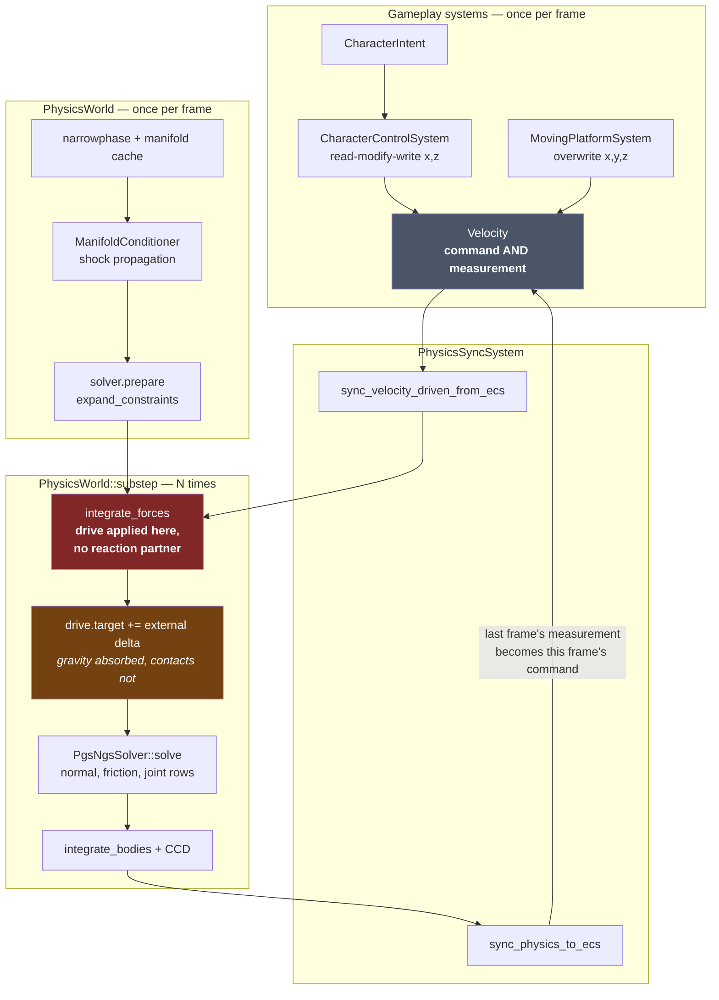
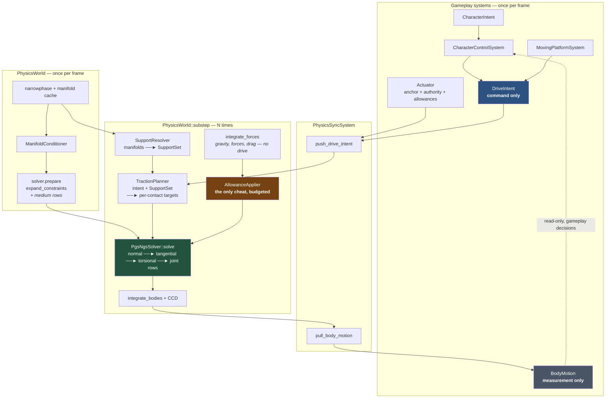
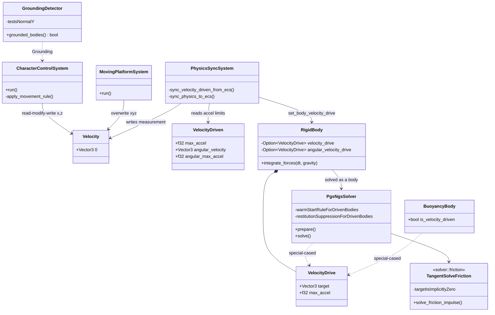
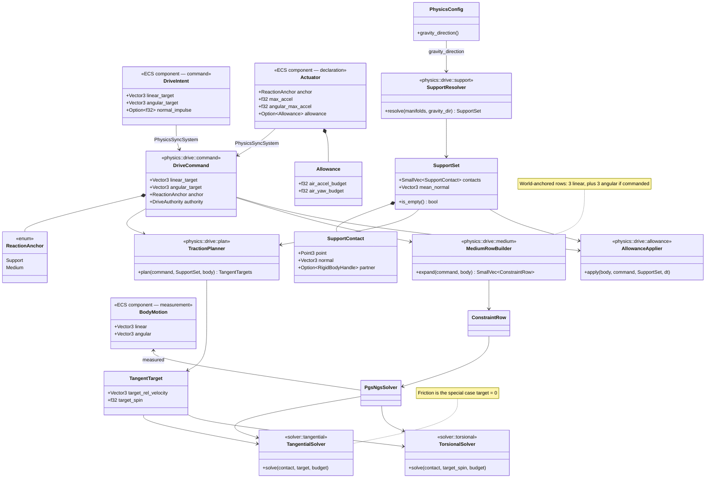
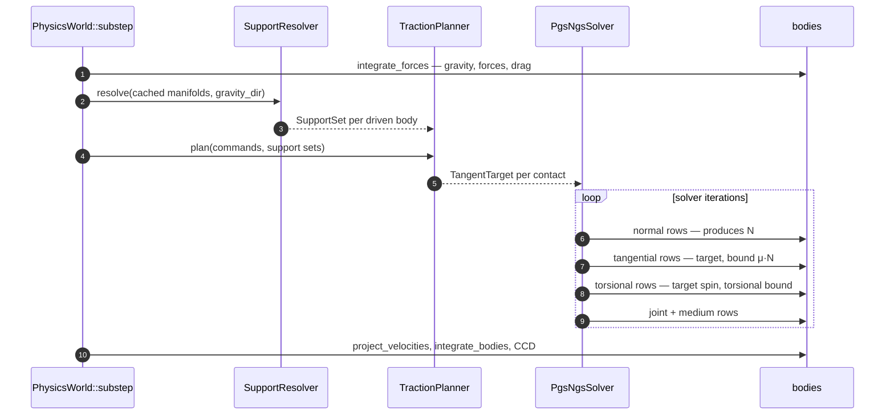

# Traction Drive — Design

Design for the mechanism that replaces `VelocityDriven`. The requirements it
must satisfy are R1–R12 in
[`VELOCITY_DRIVE_AND_PLATFORMS.md`](VELOCITY_DRIVE_AND_PLATFORMS.md) §7; that
document also records why the present mechanism behaves as it does. This one
does not repeat the diagnosis. It answers a single question:

> Where does a character's momentum come from, and what is on the other end of
> it?

**The design in one sentence:** a drive is friction with a non-zero target.

Everything below follows from that. The engine already solves, per contact, a
tangential impulse that drives relative tangential velocity to zero under a
`μ·N` bound. A walking character wants the same impulse at the same point under
the same bound, driving relative tangential velocity to *five metres per second*
instead of zero. There is no second mechanism to build — there is one parameter
to unhard-code, and a command channel to feed it.

That thesis is about the *form* of the row. It says nothing about the
*magnitudes* the row produces against this project's tuning, and those decide
how the change feels rather than whether it is correct. §10 and §11 carry that
half. Two decisions there are left open deliberately, because both are questions
about how the game should feel: they gate Stages 1 and 5, and neither gates the
acceptance tests that come first.

---

## 1. Terms

Every term coined by this design, defined before use. Terms already in the
codebase are marked *(existing)*.

| Term | Definition |
|---|---|
| **Drive Intent** | The command channel. What gameplay *wants*: a target velocity expressed relative to a reaction anchor, plus a target angular velocity. Write-only from gameplay's side, never read back. |
| **Body Motion** | The measurement channel. What the body *did*: linear and angular velocity as measured by the engine after solving. Read-only from gameplay's side. Replaces the read-modify-write role of today's `Velocity` *(existing)*. |
| **Actuator** | The per-entity declaration of *how* a body converts intent into momentum: which reaction anchor it uses, how much authority it has, and which allowances it is granted. A property of the entity, not a branch in the engine. |
| **Reaction Anchor** | The declared recipient of every equal-and-opposite impulse a drive applies. Exactly two kinds exist: **Support Anchor** and **Medium Anchor**. |
| **Support Anchor** | Reaction goes into the bodies the driven body is resting on, at the contact points. A character. Produces the correct torque on a platform by construction. |
| **Medium Anchor** | Reaction goes into the world — an infinite reservoir. A thruster, a rotor, a magnetically levitated lift. Honest but explicitly declared: the entity states that it burns an inexhaustible fuel. |
| **Support Set** | Per body, per frame: the supporting contacts, each with its contact point, normal and partner body. Derived from the manifolds the narrowphase already produced. Generalises today's `GroundingDetector` *(existing)*. Carries no weights — see §6.1 on why load distribution needs none. |
| **Contact Frame** | The orthonormal basis at a contact: the normal plus two tangents. The only basis any drive code is permitted to use. |
| **Target Relative Velocity** | The tangential relative velocity the drive asks for at one contact point, computed from the Drive Intent and the driven body's rigid-body kinematics. Zero is ordinary friction. |
| **Tangential Row** | The unified contact row that solves toward a Target Relative Velocity under the traction budget. Today's friction solve is the special case where the target is zero. |
| **Torsional Row** | The same idea about the contact normal: drives relative spin toward a target under a torsional budget. This is how a character turns. |
| **Traction Budget** | The impulse bound on a contact's tangential row, `μ_drive·N`. One budget, shared: a body spending it on drive has none left for grip. **The magnitude this produces is an open decision — see §11.** |
| **Traction Multiplier** | The proposed factor separating the drive's `μ_drive` from the contact's grip `μ`, on the grounds that feet anchor rather than slide. Per-actuator, default 1.0. **Not yet accepted — §11 records the decision it belongs to.** |
| **Normal Impulse Command** | The command-channel entry for a jump: an impulse along the support normal, delivered through the Support Set so the reaction lands on whatever is being jumped off. §6.3. |
| **Allowance** | A named, bounded, opt-in, non-conservative authority. Lives in exactly one module with an explicit per-entity budget. The design's only sanctioned cheat (R8). Its scope is much larger than "edge case": an airborne body has *zero* drive authority, ground yaw needs one (§6.2), and an unsupported jump needs one (§6.3) — so allowances cover the whole jump arc, most of turning, and one of the two ways a jump starts. Two shapes are needed, not one: an **impulse** budget, and a **projection** budget that scales or clamps velocity along an axis (jump cutoff is `v *= factor`, which no fixed impulse can express — §6.3). |
| **Effort** | *Deferred (see requirements §8).* A named authority that biases the drive to compensate for slope. Not designed here; the architecture leaves a seam for it. |

---

## 2. Existing architecture — engine level

What runs today, per frame.



Two structural faults, both visible in the diagram:

1. **The feedback edge** `Up ──► Vel`. There is one channel for two jobs, so a
   gameplay write is an edit to a measurement, and correctness depends on which
   axes each writer leaves alone (R5).
2. **`IF` has no outgoing momentum edge.** The drive is applied inside force
   integration, upstream of the solver, to one body. Nothing receives the
   reaction (R1), nothing bounds it (R7), and the solver's contact impulses land
   afterwards where the target shift can no longer see them.

## 3. Proposed architecture — engine level



What changed:

- **The feedback edge is gone.** `DriveIntent` flows down, `BodyMotion` flows
  up, and the dotted edge back into `CharacterControlSystem` carries
  *decisions* (am I falling? how fast am I going?), never a value that is edited
  and returned. R5.
- **The drive moved from `integrate_forces` into the solver.** It is now an
  impulse exchange between two bodies at a contact point, subject to the same
  bounds and the same iteration as every other contact impulse. R1, R2, R7, R9,
  R10 are properties of *where the code lives*, not of what it computes.
- **`integrate_forces` no longer knows what a drive is.** The whole
  target-shift dance at `body.rs:451–460` exists to stop a pre-solve drive from
  fighting gravity. A drive solved alongside gravity's velocity does not need
  it. Deleted.
- **One box is coloured as a cheat.** `AllowanceApplier` is the single place
  non-conservative authority may be applied, and it is empty unless an entity's
  `Actuator` declares a budget. R8.

---

## 4. Existing architecture — component level



Four places in `src/physics/` know a body is driven (`RigidBody::velocity_drive`,
the target shift, the warm-start persistence rule, the restitution suppression),
plus `integrate_forces` itself, plus the leak into `water/coupling.rs`. That is
the surface R11 caps.

## 5. Proposed architecture — component level



---

## 6. How it works

### 6.1 The tangential row

The whole design turns on one generalisation. Today, `solve_friction_impulse`
computes, for each contact:

```
Δλ = −(v_rel · t) / m_eff        bounded by  |λ| ≤ μ·N
```

The `−(v_rel · t)` is a target of zero, hard-coded by omission. The tangential
row makes it explicit:

```
Δλ = ((v_target − v_rel) · t) / m_eff     bounded by  |λ| ≤ μ·N
```

`v_target` is the Target Relative Velocity — what the drive wants the *relative*
motion at this contact to be. Friction is `v_target = 0`, unchanged in
behaviour and unchanged in cost.

The consequences are not incremental; they are the requirements:

| Because the row is… | We get |
|---|---|
| an impulse applied through `apply_impulse_pair` at the contact point | **R1** conservation, with the correct torque arm — walking `+X` at the `+Z` edge torques the platform `−Y`, because that is where the impulse lands |
| applied to a partner whose `inv_mass` is 0 when static or kinematic | **R2** silent absorption *as a mechanism*, with no code path of its own. R2's further claim that the player then accelerates "exactly as today" is **not** delivered by this and is not achievable as worded — §11 |
| expressed in **relative** velocity, per contact | **R4** support-relative targets — but *per contact*, not per body. See below: a body bridging two supports has no single anchor frame, and its world speed becomes an emergent outcome rather than a commanded one |
| bounded by `μ_drive·N` | **R7** authority bounded by the contact. Ice has low `μ`; mass ratio governs a crate push because the solver already computes it. **The absolute magnitude is the project's largest open risk — §10.1** |
| solved per contact, in the **Contact Frame** | **R6** for the drive's *basis*: no `x`, no `z`, no `Vector3::y()` in the drive path. **Not R6 for the drive's *bound*** — `μ` for the player comes from `FrictionModel::AxisBiased`, which reads a body-local up axis. Unresolved; §11 |
| one of several contacts, each independently bounded by its own `N` | **R9** distribution over supports, with no weighting term of any kind — see below |

#### The per-contact target must carry the commanded spin

With no weighting term, each support contact independently drives *contact-point*
relative velocity to its target. Contact-point velocity is `v + ω × r`, so two
contacts handed the same target vector do not merely constrain `v` — together
they pin `ω` about every axis perpendicular to their separation, at up to `μ·N`
each. The target is therefore not a vector per body but a vector per contact:

```
v_target(contact) = v_target_linear + ω_target × r_contact
```

where `r_contact` is the contact point relative to the driven body's centre of
mass. This is the well-posedness condition for a per-contact drive, and it is
what §1's definition of Target Relative Velocity means by "computed from the
Drive Intent and the driven body's rigid-body kinematics". A body-level target
vector, applied unchanged at every contact, is not a weaker version of this — it
is a different and incorrect constraint.

Getting it wrong has a specific and misleading failure mode. §6.2 concludes that
ground yaw comes from an Allowance, and an Allowance is applied *before* the
solve. A turning body gives its support contacts different tangential
velocities, so tangential rows built from a body-level target would spend their
budget undoing the yaw the Allowance had just produced. The character would turn
freely in the air and refuse to turn on the ground — which is precisely what
§6.2 predicts a weak torsional row would look like, so it would be diagnosed
there and the real cause would not be found. `TractionPlanner` owns this
equation; it is not an optimisation.

#### R9 needs no weighting term

`SupportContact` carries no share, weight or fraction, and R9 is satisfied
anyway. The mechanism is the per-contact bound: a row whose contact carries
little `N` saturates at its own `μ·N` and stops contributing, while the loaded
contact keeps pushing. Load distribution is what PGS already does.

Weighting is tempting and both forms of it are wrong. Scaling the *target* by a
share is plainly incorrect — two supports at 0.5 each would drive relative
velocity toward 2.5 m/s at both contacts, and the character would converge on
half the commanded speed. Scaling the *bound* double-counts the load, because
the bound is already proportional to `N`.

Carrying no weights also keeps the planner acyclic. A weight proportional to
accumulated normal impulse could only be computed *before* the solve, from last
frame's warm-start impulses — undefined on the substep a foot first lands, and a
division by zero in the normalisation. With nothing to weight, `TractionPlanner`
needs only the contact set and the target, and the bound is read live inside the
solve loop from `contact.accumulated_normal_impulse`, exactly as
`solve_friction_impulse` does today.

#### R4 is per-contact, and that is the honest reading

R4 asks for targets in the frame of the reaction partner. R9 asks for a body
bridging two supports. Together they describe a character with one foot on a
moving platform and one on terrain — where "5 m/s relative to the anchor" names
two different world velocities, and the two rows are mutually unsatisfiable.

The solver's answer is to split the difference according to each contact's
bound, which is defensible physics and matches what a real person straddling a
travelator experiences. But it means R4 is satisfied **per contact**, not per
body: there is no single support frame, and the character's world-space speed is
an *outcome* of the solve rather than a quantity gameplay commands.

The design accepts that reading, and one consequence follows for the ECS
surface: `BodyMotion` carries no `carrier_velocity` field. A single `Option<Vector3>`
over what is structurally a set would be the obvious thing for
`CharacterControlSystem` to use to reconstitute a world-space target — which is
the old read-modify-write loop in new clothing, and the exact place R5 would
erode first.

### 6.2 The torsional row

Turning is the same mechanism about the normal instead of within the tangent
plane: drive relative spin about the contact normal toward the intent's angular
target, bounded by torsional friction `μ_t · N · r`, where `r` is the contact
patch radius. As a *form*, R10 holds — one mechanism, two projections of it, no
second pump to build.

**As a magnitude, ground yaw through this row is zero.** Three separate facts
each suffice on their own:

- **There is no `r` to read.** `SolverContact` carries a `point`, not a patch
  (`pipeline/pair.rs:51`). A torsional bound of `μ_t · N · r` has no third term
  in this engine, and inventing one is a new geometric concept, not a
  parameter.
- **A capsule on terrain contacts at a point.** Even given an `r`, the true
  value is ~0.
- **The player's yaw inertia is deliberately 50×.** `spawners/player.rs:54` does
  `scale_local_inertia(Vector3::new(1.0, 50.0, 1.0))`, with `angular_damping(0.95)`
  on top. Whatever torsional impulse survives the first two points is then
  divided by fifty and damped.

The conclusion runs opposite to what the mechanism suggests: **the yaw allowance
is how the player turns on the ground, not a fallback for when the torsional row
disappoints.** The torsional row is worth building because it
is nearly free once the tangential row is generalised and because it is correct
for wide-contact bodies — a turntable, a tracked vehicle, a body lying prone —
but it will not turn the player.

R10 is therefore true in its anti-goal (there is no second reactionless pump)
and false in its literal reading (one mechanism does not cover both channels for
the player). The traceability table records it that way.

### 6.3 The impulse channel — jumping

A tangential row is tangential by construction, so it cannot express a jump. The
command channel therefore has two entries, not one:

```rust
pub struct DriveIntent {
    /// Continuous: solved as tangential and torsional rows each substep.
    pub linear_target: Vector3<f32>,
    pub angular_target: Vector3<f32>,
    /// Discrete: consumed once, applied along the support normal.
    pub normal_impulse: Option<f32>,
}
```

A **Normal Impulse Command** is delivered through the Support Set like any other
drive impulse: split across the supporting contacts, applied at the contact
points, with the equal and opposite impulse landing on each partner. Jumping off
a platform pushes the platform down, and jumping off the edge of one tips it —
both correct, both free, and both consequences of using the same delivery path
as traction rather than a second one.

This closes a hole that would otherwise have stopped Stage 1 dead. Today's jump
verbs reach directly into the shared `Velocity` on the `y` axis:

```rust
vel.0.y *= config.jump_cutoff_factor;   // character_control.rs:127 and :132
```

That is a read-modify-write on a measurement (what R5 outlaws) along a
privileged axis (what R6 forbids), and it is the second-most-used verb in the
game. Three variants need homes:

| Verb | Today | Under this design |
|---|---|---|
| Supported jump | sets `vel.0.y` | `normal_impulse`, delivered through the Support Set |
| **Coyote jump** | sets `vel.0.y` (`components.rs:208-214`) | **Allowance.** `CoyoteTime` is by definition the state where support has just been lost, so the Support Set is empty and there is nothing to push off |
| Jump cutoff on early release | `vel.0.y *= factor` | airborne, so no support: an Allowance, and a **projection** one — the cut is proportional to current velocity, so the same 50% is a different impulse at every point on the arc. A fixed-impulse budget would under-cut a fast jump and reverse a slow one |
| Coyote-time `clamp_up` | zeroes positive `vel.0.y` | same: a projection Allowance, since by definition there is no support left |

The coyote jump deserves emphasis, because it makes the allowance budget carry
**the single largest non-conservative impulse in the game** — a full
`jump_speed: 7.0` — rather than the air-steering nudges the word suggests. Two
jumps that feel identical to the player are then conservative in one case and
not the other: an `edge walk` and a coyote hop off the same platform torque it
differently. That is permitted by R8 and it is exactly what R8 means by *named*,
so it is written here rather than found later.

#### Consumption protocol

An edge-triggered command entering a world that runs N substeps needs three
rules, and all three bite in Stage 1:

**Which substep fires it.** The first substep of the frame, once. Firing every
substep would make a jump N× too strong, and N varies with frame time, so the
bug would present as jump height depending on framerate.

**Who clears it.** `PhysicsSyncSystem` takes the command at the frame boundary
as it pushes — `Option::take`, on the gameplay side of the seam. The physics
world never writes to an ECS component, so `DriveIntent` stays write-only from
gameplay's side and R5's shape is preserved in both directions. This is the
reason the field is `Option<f32>` rather than a flag with a separate reset.

**What happens if it cannot be delivered.** Open, and registered as **D2**
(§11).

The constraint that makes it open: gameplay cannot simply re-assert an
undelivered command, because the FSM clears the jump buffer in the same frame it
commits (`character_control.rs:122-124`), before physics has tried to deliver
anything. An undeliverable jump is therefore swallowed outright rather than
retried. Nor can consumption be split between the two sides — under `take` the
ECS-side option is already `None`, so "physics did not consume it" can only mean
"physics did nothing with it". D2 names a single owner and a single fallback.

Note what the second and third rows mean. `solve_friction_impulse` early-returns
when `accumulated_normal_impulse <= 0.0` (`friction.rs:21`), and traction
inherits that correctly — no load, no drive. So an airborne body has **zero**
drive authority of any kind, and every scrap of air control, jump shaping and
mid-air yaw is Allowance. R8's budget is not a garnish on this design; it is the
whole airborne half of the character controller, and it should be scoped that
way from the start.

### 6.4 The medium anchor

A platform's motor is not a foot. It pushes against nothing and is entitled to,
provided it says so. `ReactionAnchor::Medium` expands to ordinary
`ConstraintRow`s with `body_a: None` — the world-anchored form the constraint
system already supports for `world_fixed`, `world_hinge` and friends — with
`bias` set to the target velocity and `bounds` set from the actuator's
authority.

A `ConstraintRow` is **one degree of freedom** (`bias: f32`,
`accumulated_impulse: f32`, and `row_index` documented as "which row within the
parent constraint" — `constraint/types.rs:352`), so a Medium anchor is **three
rows** for a 3-vector `linear_target`, plus up to three more when the angular
target is non-zero. `MovingPlatform` sets angular to zero today
(`moving_platform.rs:146`), but `Actuator` declares an `angular_max_accel`, so
the builder must handle the angular case rather than assume it away. Every other
constraint in the system already expands to a row set; this one is no
exception.

The lift therefore does not recoil when it carries a passenger, and the
passenger still recoils onto the lift, exactly as R3 requires. Both are honest;
the difference is one enum variant on the entity, not a second code path in the
engine.

### 6.5 Ordering inside the substep

The traction budget is `μ·N`, and `N` is not known until the normal rows are
solved. This is not a new problem — friction has always had it, and the solver
already resolves it by solving normals first within each iteration and reading
`contact.accumulated_normal_impulse`. Traction inherits that ordering
unchanged:



Nothing in this sequence is new machinery. Steps 2–4 are the addition; the loop
gains two row kinds and loses nothing.

### 6.6 The support set replaces grounding

`GroundingDetector::grounded_bodies` today tests `normal.y >= 0.5`. The
`SupportResolver` computes the same answer from the same manifolds against
`PhysicsConfig::gravity_direction()` — the normalise-with-fallback currently
open-coded at `world.rs:688`, lifted to a method as the requirements ask — and
returns the contacts themselves rather than a boolean.

**But `Grounding` becomes a projection of the Support Set only for unanimated
bodies, and the player is not one.** `ContactGroundingSystem` deliberately skips
rigged humanoids (`character/grounding_system.rs:17-21`, `!&animators` at :53);
for them `CharacterAnimationSystem` writes `Grounding` from the foot probes
(`animation/systems.rs:124`), because probes "resolve ledges and steps far better
than a capsule's contact set does" — they see the ledge the sole is over.

That is a deliberate and good decision, and this design does not overturn it.
What it means is that the character FSM and the drive read **two different
sensors**, not one sensor at two times: the probe answer is deliberately *ahead*
of the contact answer, and `CharacterControlSystem` runs before
`PhysicsSyncSystem` while both grounding writers run after it
(`dispatcher_builder.rs:46,56,82,91`), so it is a frame stale as well. The FSM
can therefore commit a jump in a frame where the Support Set is empty, by
design and not by accident. D2 (§11) is where that is resolved; Stage 2 must not
be written as though unifying the two sources were a refactor.

R6 holds for the drive, and for contact-derived grounding.

**Support-relative speed is another projection of the same thing, and naming it
here is what keeps `carrier_velocity` dead.** §6.1 removed that field from
`BodyMotion` because a single `Option<Vector3>` over a structural set is where
R5 would erode first. But something downstream genuinely wants the quantity it
promised: animation consumes world velocity, so a walker holding station on a
platform running at 4 m/s reads as moving at 4 m/s. The visible symptom today is
head tilt — `compute_head_tilt` takes `velocity.magnitude()`
(`animation/humanoid/stride_sync.rs:105`) — and any gait or stride consumer of
world velocity has the same exposure.

The successor is `SupportSet::relative_speed(body)`: the driven body's velocity
measured against its supports, weighted by normal impulse for exactly the
averaging job the drive path refuses to do. It is a query on the Support Set,
computed where the contacts already are, and it is not a component. Naming it
now matters, because Stage 1 will otherwise grow `carrier_velocity` back the
first time an animator notices the sprinting passenger.

---

## 7. SOLID

Not decoration; each principle names the specific failure it prevents here.

**Single responsibility.** The present `Velocity` has two — command and
measurement — and that is R5's entire complaint. The split into `DriveIntent`,
`Actuator` and `BodyMotion` gives each one job. Inside physics: `SupportResolver`
finds supports, `TractionPlanner` turns intent into per-contact targets,
`TangentialSolver` solves one row. A change to how supports are detected touches
one file.

**Open/closed.** `ReactionAnchor` is the extension point. A magnetic-boots
character that pushes against a wall, a swimmer pushing against water, a
grappling hook pushing against a rope — each is a new anchor kind, and none of
them modifies `TangentialSolver`, `PgsNgsSolver` or `RigidBody`. Contrast the
present design, where every new driven-body behaviour has meant another
`is_velocity_driven` branch.

The wall example is currently blocked, and not by the anchor abstraction: the
player's `FrictionModel::AxisBiased` sets `wall: 0.0` (`spawners/player.rs:44`),
so while the traction budget draws `μ` from the contact, a wall anchor transmits
exactly nothing. The extension point is open; the bound is what closes it. D1
(§11) is where that is decided.

**Liskov.** After this work a driven body *is* an ordinary rigid body through
the whole solve: nothing in `integrate_forces`, `integrate_bodies` or CCD needs
to ask whether it is driven, because a drive is now indistinguishable from any
other contact impulse. This is R11 restated as a type-level property.

**Sleeping is the exception, and it is an expected survivor rather than an
oversight.** `set_body_velocity_drive` wakes the body on every call
(`world.rs:523`), and that wake is load-bearing: `EnergyTracker::update_body`
(`sleep/energy.rs:29`) is purely velocity-based with no drive awareness, so a
driven body with a saturated bound and near-zero velocity — a character walking
into a wall, or leaning on a crate too heavy to move — falls below both
thresholds for `delay_frames` and sleeps. Once asleep its traction rows stop
being solved, and by the engine's own warning at `world.rs:288-292` any impulse
aimed at it is discarded. The player would freeze against the wall and stay
frozen after releasing the stick.

`push_drive_intent` therefore inherits the wake, and its condition is "does this
entity have a non-trivial `DriveIntent`" — a body-is-driven test living in the
sleep path. It gets the comment R11 asks for, naming that failure.

One apparent instance is not one. `water/coupling.rs:224` gates a wake — a
self-propelled thing pushes water behind it — which is a gameplay and VFX
categorisation, not a physics special case. It **relocates** to "does this entity
have an `Actuator`"; it does not disappear. It also lives in `src/water/`, and
R11 counts sites in `src/physics/`, so it was never inside the budget it might
otherwise be credited against.

**Interface segregation.** `CharacterControlSystem` takes `DriveIntent`
(write) and `BodyMotion` (read) and cannot express "edit the measurement".
`MovingPlatformSystem` takes `DriveIntent` alone. The compiler enforces R5
rather than a comment asking writers to leave the `y` axis alone.

**Dependency inversion.** The solver depends on the `TangentTarget` abstraction,
not on the concept of a character. Gameplay depends on `Actuator`, not on
`RigidBody`. Both follow the house pattern already set by `StaticGeometry`,
`ConstraintSolver` and `ManifoldConditioner`: the physics engine states what it
needs as a trait and lets the caller supply it.

---

## 8. Requirements traceability

| Req | Satisfied by | Mechanism or construction? |
|---|---|---|
| R1 Conservation | §6.1 tangential row via `apply_impulse_pair` at the contact point | construction |
| R2 Infinite-mass partners | `inv_mass == 0` on the partner | mechanism yes; **"accelerates as today" no — open, §11** |
| R3 Declared reaction partner | `Actuator::anchor`, `ReactionAnchor` §6.4 | declaration |
| R4 Support-relative targets | row solves *relative* velocity §6.1 | **per contact, not per body** — a bridging body has no single anchor frame and its world speed is an outcome, §6.1 |
| R5 Command ≠ measurement | `DriveIntent` / `BodyMotion` split §3, §7 | type system |
| R6 No privileged coordinates | Contact Frame §6.1; `gravity_direction()` §6.6 — **basis only, bound unresolved** | partial, §11 |
| R7 Authority bounded by contact | `μ_drive·N` row bounds §6.1 | mechanism by construction; **magnitude undecided, §10.1 / D1** |
| R8 Cheats named and bounded | `Allowance` + `AllowanceApplier`, single module | discipline, one file |
| R9 Distribution over supports | per-contact `μ·N` bound alone, no weighting term §6.1 | construction |
| R10 Linear and angular unified | torsional row §6.2 | **form only** — ground yaw is an Allowance in practice, §6.2 |
| R11 Surface does not grow | see below | measured, gated |
| R12 Tests first | §9 stage 0 | process |

**R11 in detail.** Today's surface, from the requirements: `RigidBody::velocity_drive`,
the target shift, the warm-start persistence rule, the restitution suppression,
and the `integrate_forces` application. The requirements list five; there are
**six**. The sixth is the sleep wake at `world.rs:523` (§7), which the
requirements' own inventory misses — so the count to beat is higher than R11
states, and the sixth is the one site this design expects to keep.

The `water/coupling.rs` flag is outside that scope and is a relocation, not a
deletion (§7).

After this design: `RigidBody` carries no drive state at all; the target shift
and the `integrate_forces` application are deleted along with it. The
warm-start and restitution special cases in `pipeline/solver.rs` exist because a
pre-solve drive re-asserts approach velocity every substep, keeping persisted
contacts permanently above `restitution_velocity_threshold`. A body whose
velocity changes *only* through solved impulses does not do that, so the
expectation is that both can be deleted too. That expectation is a claim about
behaviour, not a proof — it is exactly what the `driven body at rest` and
`stack stability` acceptance tests exist to check. **If either special case must
survive, it survives with a comment naming the instability it prevents, and the
count is still lower than today.**

---

## 9. Delivery plan

Sequenced so that each stage is independently verifiable and no stage leaves
the game unplayable.

**Stage 0 — Acceptance tests (R12, blocking). Landed.** All eight scenarios
from the requirements table live in
`src/physics/bench_harness/tests/traction_drive.rs`, driving the real
`PhysicsWorld` with `CharacterControlSystem` and `MovingPlatformSystem` replayed
by hand in dispatcher order. **Nothing else starts until this is green where it
should be green** — the current behaviour is partly accidental, so without this
a regression and a correction look identical.

What the eight measured against the current engine:

| Scenario | Kind | Measurement |
|---|---|---|
| vertical lift carry | specification | rides at 1.83 m/s with **zero** slip and zero gap movement |
| reversal hover | specification | gap opens 0.80 → 1.45 m at the reversal, platform catches them |
| horizontal lift carry | characterisation | **the passenger is not carried**: braked to 0.00 m/s under a 3 m/s deck, drifts 12.8 m along it and falls off the back |
| cruise under load | specification | 1.828 m/s against an authored 2.0 and a 131 kg passenger — the same one frame of gravity the unloaded lift sags by |
| edge walk | characterisation | platform yaws **+0.41 rad/s**, *with* the walker. Conservation demands the opposite sign (R1) |
| crate push | characterisation | a 768 kg crate is *punted* to 4.70 m/s — 6.5× the 0.73 m/s the mass ratio predicts, and near the walker's own 5.0 walk speed |
| stack stability | specification | no lateral drift, box speeds under 0.04 m/s |
| driven body at rest | specification | resting against the wall at x = 0.262, velocity identically zero |

The two defects the design exists to fix are asserted **in their broken form**,
with the inversion spelled out in the failure message: when `edge walk` starts
failing with a negative yaw and `horizontal lift carry` with a zero drift, the
traction drive has landed and those assertions become specifications. Two
further assertions are D1-gated as §11 requires — `crate push`'s peak is
compared against the mass-ratio speed rather than pinned to a number.

One assertion in `crate push` is a specification today and stays one under
either D1 outcome: the crate never outruns the walker (measured overtake
0.006 m/s). A crate that outran its pusher would be receiving momentum from
nowhere at the far end of the same pump.

Stage 0 **characterises**; it does not specify. Two assertions depend on the
still-open D1 (§11) — the acceleration precondition behind `edge walk`, and
`crate push`'s mass-ratio claim — and both land tagged as characterisations,
recording what the engine does today rather than what must remain true. They are
promoted to specifications when D1 is settled. Stage 0 is therefore **not**
blocked by D1 and should be built first regardless: it is the safety net for
every stage after it.

**Stage 1 — Channel split. Gated on D2 (§11).** `DriveIntent`, `Actuator`,
`BodyMotion`; gameplay systems rewritten to write intent only, which means every
jump verb needs its home decided first (§6.3). No physics change:
`PhysicsSyncSystem` translates the new components into today's
`set_body_velocity_drive`, and inherits its sleep wake (§7). R5 lands alone, and
the Stage 0 tests must not move.

**Stage 2 — Support set.** `SupportResolver` and `SupportSet`; `GroundingDetector`
reimplemented on top of it against `gravity_direction()`. R6 for
contact-derived grounding. Still no change to how the drive is applied.

This stage covers `ContactGroundingSystem`'s consumers only. Rigged humanoids
take their `Grounding` from foot probes by deliberate design (§6.6), so bringing
the player onto the Support Set is **not** part of this stage and is not a
refactor — it is D2b, and D2 may well decide against it.

**Stage 3 — Tangential row.** Generalise `solve_friction_impulse` to take a
target, with every call site passing zero. A pure refactor, and the stage's
entire value is that any movement in the bench numbers means a real bug — so pin
the expression form rather than trusting the algebra: the generalised row must
compute `(v_target - v_rel).dot(&t)` without reassociating into
`v_target.dot(&t) - v_rel.dot(&t)`. With `v_target = 0` the first form is
bit-identical to today's `-(v_rel · t)` except for the sign of zero; the second
is not guaranteed to be.

**Stage 4 — Medium anchor.** Platforms move to `ReactionAnchor::Medium`,
expanded as world-anchored `ConstraintRow`s. Platforms **drop `VelocityDriven`
at this stage**; the field survives in the engine for the player until Stage 5.
A platform carrying both a velocity drive and a medium row toward the same
target would get roughly twice the authority its actuator declares, and the
row's bounds would stop meaning anything — so the two must never overlap on one
body. `cruise under load`, `vertical lift carry` and `horizontal lift carry`
must hold. This is the lower-risk half of the change and it is independently
verifiable, so it goes first.

**Stage 5 — Traction. Gated on D1 (§11).** `TractionPlanner` feeds real targets,
carrying the commanded spin per contact (§6.1); delete
`RigidBody::velocity_drive`, the target shift, and the `integrate_forces`
application. `edge walk` flips sign, and the two Stage 0 characterisations are
promoted or rewritten according to D1's outcome. This is the risk-bearing stage,
the first at which a traction bound governs real behaviour, and by the time it
arrives it is the shortest possible diff.

*Why this order.* Platforms have no drive other than `VelocityDriven`
(`moving_platform.rs:144`). Deleting it before they have a medium anchor stops
every platform in the game and turns three of the eight Stage 0 tests red for
reasons unrelated to what the stage changed — which is exactly the signal Stage
0 exists to protect.

**Stage 6 — Torsional row and allowances.** R8 and R10. Scope the allowance work
as the airborne character controller in full (§6.3), not as a garnish. Play-test
for feel; this is where the deferred **Effort** question (requirements §8) gets
answered with data instead of prediction.

**Stage 7 — Surface audit.** Count the drive-aware sites in `src/physics/`;
delete the `pipeline/solver.rs` special cases if the tests permit. Relocate
`BuoyancyBody::is_velocity_driven` to an `Actuator` test — it is a wake gate, not
a physics special case, and it was never in the R11 budget. Justify every
survivor in a comment. R11.

---

## 10. Known risks

### 10.1 The acceleration cliff — the largest risk in the project

The form of the tangential row says nothing about the numbers it produces
against this project's actual configuration, and those numbers decide how the
change feels.

`LocomotionConfig::ground_accel` is **40.0 m/s²** (`character/config.rs:81`).
Under R7 the steady-state traction bound on flat ground is `μ·m·g / m = μ·g`:

| Surface | How `μ` is combined | `μ` | Ceiling |
|---|---|---|---|
| Terrain | static contacts take the collider's own friction, no combine (`static_contacts.rs:93`) | 0.80 | **7.85 m/s²** |
| Moving platform | dynamic pairs take the geometric mean (`collider.rs:188`) of player 0.8 and platform 0.9 | 0.85 | **8.32 m/s²** |

That is a **~5× cut in both acceleration and braking**. A stop from
`walk_speed: 5.0` goes from roughly 0.13 s to 0.64 s. Stage 5 will not read as
"edge walk flips sign"; it will read as "the character became a curling stone".

A second consequence follows from the table rather than the headline: the
ceiling is a property of whatever the character is standing on. The same stick
input gives measurably different responsiveness on terrain, on a platform, and
on a crate. That may be desirable — it is what makes a surface feel like a
material — but it is new, and it is not something any current tuning value
anticipates.

This is **not** the deferred **Effort** question, which is about slopes. The
missing concept is that real feet do not behave as Coulomb sliders; they anchor.
Whatever it ends up being called, the design must state that `μ_drive` is not
the `μ` the contact uses for grip, or explicitly accept the feel change. §11
records this as the decision it belongs to, and it blocks Stage 0, because Stage
0 has to write an assertion about ground acceleration and cannot do so until it
is settled.

### 10.2 Jumping gains a direction it did not have

The same species as the cliff above: a magnitude consequence the form of the
design does not reveal, and one that decides feel rather than correctness.

Today `vel.0.y` means the player always jumps straight up, whatever they are
standing on. §6.3 delivers a jump along the **support normal**, so on a slope
they jump at an angle. `cos_floor` is 45° (`spawners/player.rs:46`), so any
surface up to 45° is a valid support, and at that limit the jump keeps
`cos 45° = 71%` of its vertical velocity — but height goes as `v²`, so it loses
**half its height**, while gaining lateral speed the player never asked for.

That may be exactly what is wanted: it makes slopes read as slopes. But it is a
decision, and if it is not wanted the correction is available and legal. R6's own
carve-out explicitly sanctions reading the world's gravity through an accessor,
so a documented blend of the support normal toward `-gravity_direction` is
permitted by the requirement rather than in tension with it. What R6 forbids is a
literal `Vector3::y()`, and the blend does not need one.

### 10.3 Everything else

**KeepUpright sits downstream of every conservation claim.** The player's
upright constraint uses `Enforcement::HardProjection` with
`max_impulse: f32::INFINITY` (`spawners/player.rs:59-64`) — a post-solve velocity
rewrite (`constraint/types.rs:340`) that runs after the solve, outside it, and
non-conservatively. Traction at a single off-axis foot contact induces tilt; that
tilt is then silently eaten by the projection. R1 is satisfied *within* the
solve, and the design should not claim more than that until the interaction is
measured. The `edge walk` and `stack stability` scenarios are the place it will
show up.

**A character's contact patch is small.** A capsule resting on terrain may
produce a single contact, giving a small lever arm for the reaction. For yaw the
consequence is not "weak" but zero, and §6.2 treats the allowance as the ground
mechanism rather than a mitigation. Stage 6 measures it.

**Fresh contacts have no budget for one substep.** A contact created this
substep has `accumulated_normal_impulse` near zero at the first iteration, so
its traction bound starts near zero and grows as the normal row converges. This
is the same warm-up friction already has; the expectation is that it is
invisible, and the `crate push` jitter assertion is the check.

**The friction cone clamp becomes direction-dependent.** §6.1 writes the row as
a scalar per tangent, but the existing solve computes `delta_t1` and `delta_t2`
separately and then clamps the pair jointly to one cone (`friction.rs:47-59`).
With a non-zero target the clamp no longer merely shortens an opposing impulse —
it rotates a commanded one. "Unchanged in cost" is true; "unchanged in
behaviour" holds only for `v_target = 0`, which is the Stage 3 invariant and not
a general claim.

**Traction and grip share one budget.** They must — that is R7 — but it means a
character accelerating hard has less grip against a slope, and walking uphill
will cost speed. This is the *intended* physics and the reason the requirements
already anticipate an **Effort** parameter. It is a feel decision, deferred, and
the architecture leaves it as a bias on the target rather than a return to
privileged axes.

**The solver-native route has bitten before.** The current `integrate_forces`
formulation was itself arrived at after instabilities, so "put it in the solver"
is not automatically safer for having a nicer diagram. The mitigation is Stage
3: the row generalisation ships as a no-op refactor with the target pinned to
zero, so if the solve is going to destabilise, it does so behind a
single-commit revert — before any behaviour depends on it.

---

## 11. Open decisions

Two decisions are unresolved. Neither blocks Stage 0. **D1** gates Stage 5 and
moves two Stage 0 assertions from specifications to characterisations; **D2**
gates Stage 1, and is the smaller of the two.

### D1 — Does R7's bound win over R2's promise, and at what magnitude?

R2 promises that "a player walking on the world's terrain accelerates exactly as
they do today". R7 requires that no drive exceed `μ·N`. §10.1 shows the two
differ by a factor of five. Both are currently asserted, and both cannot stand.

**R7 wins on mechanism, and R2 is reworded to its real content** — "no separate
code path for infinite-mass partners". That much is settled: R2's parenthetical
is a magnitude claim wearing a mechanism claim's clothes, and no design can
deliver it alongside a contact-bounded drive.

What is *not* settled is how the feel is recovered. Both options below introduce
a **Traction Multiplier** so that `μ_drive ≠ μ_grip` — the named statement that
feet anchor rather than slide. They differ in what the multiplier multiplies,
and the difference is not cosmetic.

#### D1a — scale the contact's own friction

```
μ_drive = μ_contact × actuator.traction_multiplier    // default 1.0, player ≈ 5
```

#### D1b — replace it with a per-actuator coefficient over a material grip

```
μ_drive = actuator.traction × collider.grip           // new isotropic field
```

| | D1a — scale contact μ | D1b — per-actuator μ_drive |
|---|---|---|
| Ice | bites, free | bites only if `grip` is plumbed — one new field |
| `AxisBiased` in the drive path | yes — **R6's bound stays false** | no — **R6 discharged** |
| `wall: 0.0` / boots anchor | `5 × 0.0 = 0.0`, still dead | expressible |
| Surface legibility (§10.1) | preserved free | preserved via `grip` |
| New concepts | one multiplier | one multiplier, one material field |

**The recommendation is D1b.** It is the only option that discharges R6's bound
and the only one that makes `ReactionAnchor` a real extension point rather than
a diagram.

The reason D1b's ice cost is smaller than it looks is that
`FrictionModel::AxisBiased` is **not a material property**. The comment above it
says so outright (`spawners/player.rs:33-38`): floor friction keeps the player
planted, and wall friction is near zero "so jumps along vertical surfaces don't
get grabbed". That is a character-controller tuning device that happens to live
in the collider material system. `wall: 0.0` is not a claim that walls are
frictionless; it is a claim that the jump code does not want to be grabbed by
one.

So D1b does not throw surface response away — it stops the drive reading a
controller hack and gives it a real material coefficient instead, while
`FrictionModel` keeps its hack for contact grip. Ice is low-`grip` and bites; a
wall has never had zero grip and transmits drive; `local_up: Vector3::y()`
(`spawners/player.rs:45`) leaves the drive path entirely. **The genuine cost is
two coefficients per material that can drift apart if authors are careless**,
and that is a real maintenance burden, not a formality.

#### What D1 costs whichever way it goes

These follow from `μ_drive > μ_grip` itself, so neither option escapes them.
They are the reason the multiplier should be as small as the feel permits rather
than as large as the old `ground_accel` implies.

- **You can walk up a slope you cannot stand on.** Grip is `μ`, drive is `5μ`,
  so the standing limit is `atan(0.8) ≈ 39°` and the walking limit is
  `atan(4.0) ≈ 76°`. Stop moving and you slide; start moving and you climb.
  Arguably good platformer behaviour — but it should be a decision, not an
  emergent surprise.
- **`crate push` stops being a mass-ratio test.** The requirement's assertion,
  "push speed follows the mass ratio", is only honest when
  `μ_drive == μ_grip`. At 5× the player transmits five times the tangential
  force through the same contact and the outcome is no longer the mass ratio the
  requirement names.

**The alternative to all of this is to accept the feel change**, ship the
7.85 m/s² ceiling with `traction_multiplier = 1.0`, and tune `walk_speed` and
the animation around it. That is a coherent choice — the most physically honest
version of this design, and the one that makes surface material most legible in
play. It is a game-design decision about how the character feels rather than an
architectural one, which is why it sits in this section and not in §6.

#### Why this does not block Stage 0

Stage 0 is the safety net for every stage after it, and an open feel decision is
not a reason to leave it unbuilt.

Stage 0 **characterises the current engine**. Ground acceleration is 40 m/s²
today whatever D1 decides, and every one of the eight scenarios is writable
now. What D1 gates is only whether a recorded number is a *characterisation*
(this is what the engine does) or a *specification* (this must remain true).
Two assertions are affected — the acceleration precondition behind `edge walk`,
and `crate push`'s mass-ratio claim. Both land as characterisations, tagged as
such, and are promoted to specifications when D1 is settled.

D1 must be settled before **Stage 5**, which is where a bound first governs real
behaviour.

Until then, §8 marks R2 and R6 as open rather than satisfied, and R7's row
records that its magnitude is undecided.

---

### D2 — What happens to a jump the Support Set cannot deliver?

The FSM commits a jump from `Grounding` and clears the buffer in the same frame
(`character_control.rs:122-124`), before physics has tried to deliver anything.
If the Support Set is empty on the firing substep, the jump is swallowed: the
buffer is gone, `set_vy` was never applied, and the input is lost.

This is not an exotic race. §6.6 establishes that the FSM and the drive read two
different sensors — foot probes for rigged humanoids, contact manifolds for the
Support Set — and that the probe answer is deliberately *ahead* of the contact
one. The FSM committing a jump with no physics support is a designed behaviour,
not a glitch, and `CoyoteTime` is that behaviour with a name on it.

**Severity, stated precisely.** The consequence is a dropped input and up to
`launch_window: 0.2 s` of degraded ground control — not a lockup. `Launching`
gained a time-based exit in `8211d70` ("Bound the launch window so a jump cannot
trap the character"), so it promotes to `Airborne` regardless of grounding and
the next tick returns to `Grounded`. This matters for choosing a fix: a
swallowed jump does not justify the invasive option below, and a lockup would.

| | What it does | Cost |
|---|---|---|
| **D2a — Allowance fallback** | A jump commanded with an empty Support Set is delivered as an Allowance instead of through the contacts | A jump is silently non-conservative some of the time |
| **D2b — Same snapshot** | The FSM's grounded decision and the delivery support set must be the same snapshot | Overturns the deliberate probe-grounding decision (§6.6); the FSM stops seeing the ledge the sole is over |
| **D2c — Confirmed delivery** | The FSM holds the buffer until physics confirms | Needs a channel back from physics; `BodyMotion` is measurement-only, so this widens the seam R5 exists to keep narrow |

**The recommendation is D2a**, because it is not a new mechanism — §6.3 already
routes the coyote jump through an Allowance for exactly this reason, and D2a is
that rule stated once for every unsupported jump rather than for the one state
that happens to be named after it. One rule covers both cases: a jump with no
support is a coyote jump whatever the FSM calls it. Nothing is ever dropped, the buffer clear becomes harmless, no channel back is needed, and the
`Option::take` ownership question dissolves because the sync always consumes.

D2a's cost is real and belongs in R8's ledger rather than being waved past: the
same player action is conservative or not depending on a sensor disagreement
they cannot perceive. That is the price of keeping foot probes as the grounding
source, and §6.3 already accepts a version of it for `CoyoteTime`.

D2 must be settled before **Stage 1**, which is where gameplay stops writing
velocity and the jump verbs need somewhere to go.
