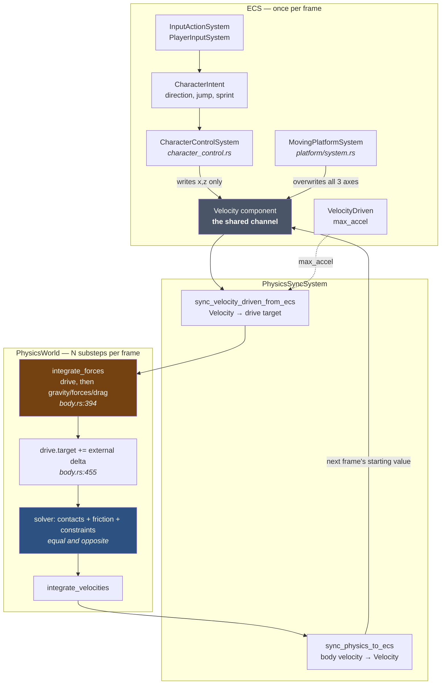
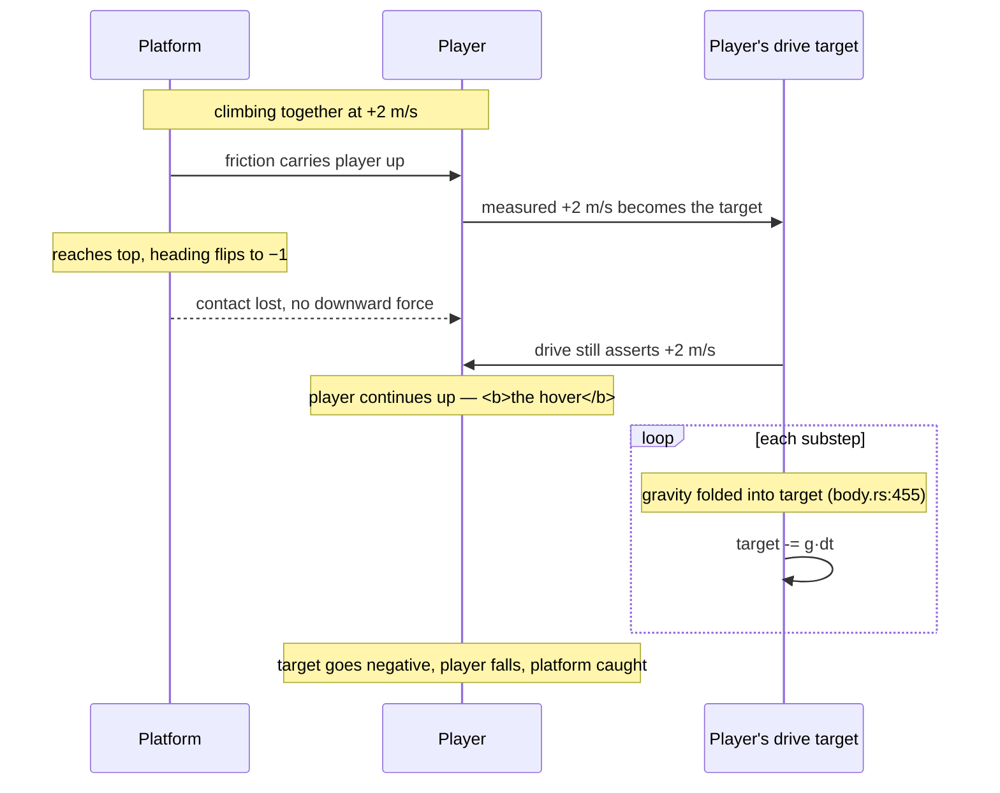
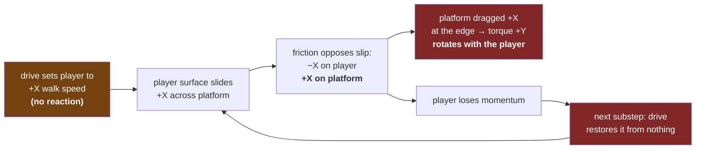

# Velocity Drive and Moving Platforms

How a player riding a powered platform actually works in this engine, why the
ride is smooth, and why walking along the platform's edge spins it the wrong
way.

The short version: **`VelocityDriven` is a reactionless external momentum
source.** Every behaviour described below follows from that one fact.

---

## 1. The components



The load-bearing detail is the **loop**: `Velocity` is not an authored command.
It is last frame's *measured* body velocity (`sync_physics_to_ecs`, called at
`physics_sync.rs:333`), which the gameplay systems then partially overwrite
before it is handed back down as this frame's drive target.

Who writes what into that channel differs, and this is the whole story:

| Writer | Axes written | Effect |
|---|---|---|
| `CharacterControlSystem` via `apply_movement_rule` (`character_control.rs:366`) | **x and z only** | steers horizontal velocity toward walk speed at `ground_accel`; **y passes through untouched** except on jump/cutoff |
| `MovingPlatformSystem` (`platform/system.rs`) | **all three** | overwrites with `axis * speed * heading` every frame |

---

## 2. Why the ride works (and why I predicted it wouldn't)

I claimed the player would slide off because the drive target is world-space and
would brake against the carry. That is wrong for a **vertical** lift, for a
reason visible in `apply_movement_rule`:

```rust
vel.0.x = move_toward(vel.0.x, rule.target.x, max_delta);
vel.0.z = move_toward(vel.0.z, rule.target.z, max_delta);
// vel.0.y is never touched here
```

Two things save the ride:

1. **`vel.0` starts as the measured body velocity**, not zero. It is a
   *modification* of reality, not a command issued in ignorance of it.
2. **The vertical axis is never modified.** So the drive target's `y` is
   literally "keep doing what you are already doing vertically".

Friction from the platform lifts the player; that velocity is written back into
`Velocity`; next frame it becomes the player's own drive target. The drive
therefore *ratifies* the carry rather than fighting it. No frame-tracking code
is needed, and none exists.

The hover at the top falls out of the same mechanism plus `body.rs:455`:



The "hover" is not a bug and not a special case. It is the player's drive target
holding the last velocity it measured, while `body.rs:455` bleeds gravity into
that target one substep at a time until it goes negative.

**A *horizontal* platform does not carry at all.** There, `x` and `z` are
overwritten toward the walk target (zero when idle) at `ground_accel`, so the
drive brakes against the carry. The vertical case is safe precisely because it
is the one axis gameplay does not touch. This was a prediction; the
`horizontal_lift_carry` acceptance test now measures it. A deck running at
3 m/s under an idle passenger leaves them at **0.00 m/s in world space**: the
platform slides out from under them in under a second and they fall off the
back. `levels/test_arena.level.ron` carries a horizontal run at z = −18 to see
it in play.

---

## 3. Why walking the edge spins the platform the wrong way

### What the engine does

`integrate_forces` applies the drive **directly to one body's velocity, with no
reaction partner** (`body.rs:400`):

```rust
if let Some(drive) = &self.velocity_drive {
    let delta = drive.target - self.linear_velocity;
    let max_delta = drive.max_accel * dt;
    self.linear_velocity += delta * (max_delta / delta_mag).min(1.0);
}
```

Nothing anywhere receives an equal and opposite impulse. The player accelerates
because an invisible hand outside the physical system pushes them.

Friction then does its job correctly, which is what makes the result wrong:



The player is behaving as a **conveyor belt**, not a walker: a surface held at
constant velocity by an external agency, dragging whatever it touches along with
it. A conveyor drags its load *forwards*. That is exactly the rotation observed.

### What conservation demands

For an isolated player-plus-platform system, the player's momentum must come
*from* the platform. The platform pushes the player `+X`; the reaction on the
platform is `−X`; applied at the `+Z` edge that is a `−Y` torque — the platform
rotates **opposite** to the player's motion, and the two centres of mass stay
put. That is the expectation, and it is correct.

### Why the sign flips

The engine does not get friction backwards. It gets the *momentum source*
backwards. Real walking:

```
player momentum ← friction ← platform     (platform recoils: −X)
```

This engine:

```
player momentum ← drive ← nowhere
platform momentum ← friction ← player     (platform dragged: +X)
```

Friction is still equal and opposite. It is the drive that is not.

### Why the loop never closes

`body.rs:451–460` deliberately folds external effects back into the drive
target so drives do not fight gravity:

```rust
// Shift drive targets by external forces (gravity, accumulated forces,
// drag, torques, gyroscopic correction) so drives don't fight these
// effects across substeps.
drive.target += self.linear_velocity - vel_after_drive;
```

That shift is computed **inside `integrate_forces`**, which runs *before* the
solver. Contact and friction impulses land afterwards, so they are never folded
into the target. The consequence:

- Gravity is absorbed → the drive does not fight it (intended, and what makes
  the lift sag exactly `g · frame_dt`).
- Friction is **not** absorbed → the drive re-asserts the stolen velocity on the
  very next substep.

So friction bills the player every substep and the drive pays the bill from an
infinite account. Momentum flows into the platform continuously and never leaves
the player. This is the pump.

---

## 4. The same defect on the platform's own motor

`MovingPlatformSystem` overwrites all three axes with `axis * speed * heading`
every frame, so the platform's drive target is re-authored from scratch rather
than round-tripped. Its motor is reactionless too: it pushes against nothing,
and a lift carrying a player does not slow down because the load's contact
impulse is not folded into its target either.

The measured `lift_holds_cruise_speed_against_gravity` result (1.8365 m/s
against an authored 2.0) is this system working as designed — the shortfall is
one frame of gravity, and gravity is the *only* thing the target absorbs.

Stalling is still possible but only transiently: the drive can restore at most
`max_accel · dt` per substep, so a load removing more than that stalls the
platform for as long as it keeps doing so. It never loses ground permanently.

---

## 5. State of play

**Implemented and verified**
- Vertical carry of a passenger, including ballistic hover at the reversal.
- Platform patrol, endpoint reversal, cruise speed against gravity.
- Rigid attitude via `KeepUpright` with unlimited authority.

**Implemented, consequences not yet chosen**
- Reactionless linear drive on both player and platform (this document).
- Reactionless *angular* drive: `vd.angular_velocity` at
  `character_control.rs:154` turns the player with the same no-partner
  mechanism.
- Free yaw on the platform — `KeepUpright` locks only the two tilt axes.

**Not implemented**
- Any reaction from a driven body onto what it is standing on.
- Horizontal-platform carry (see §2) — measured, and it does not work: the
  passenger is braked to a standstill and dropped off the back.

**Characterised**
- All eight scenarios in §7 R12 now exist as acceptance tests
  (`src/physics/bench_harness/tests/traction_drive.rs`), pinning current
  behaviour — including the two defects this document names, so that fixing
  them is visible as a sign change rather than a mystery.

The platform's route is now a servo rather than a heading: cruise along the leg
at `speed`, plus a proportional correction across it. That closes the gravity
sag a horizontal run would otherwise suffer — the drive is a velocity source, so
gravity is a *velocity* disturbance of `g · frame_dt`, and a proportional
correction leaves it standing at that over `route_gain`, measured at 10 mm.

---

## 6. Where a fix would live

Recorded for later; no code yet. The requirements this has to satisfy are in
§7.

The minimal honest change is to make the drive **spend its impulse against the
supporting body** rather than against the world: when a driven body is in
contact, apply `−Δp` to the contact partner, distributed at the contact points
so it produces the right torque. That converts the drive from a velocity source
into something closer to a real actuator, and the edge-walking rotation flips to
the correct sign by construction.

The obvious cheap alternative — folding contact impulses into the drive target
alongside gravity at `body.rs:455` — is a trap. It would stop the pump, but it
would also make the player's drive surrender to *every* contact, including the
ground they are trying to walk on, so walking would stop working entirely.

Note the interaction with `sensing/probe` and grounding: whatever receives the
reaction must be the body actually supporting the character, which is
information the probe already computes.

---

## 7. Design requirements

Requirements for the replacement mechanism. No code yet; this is the contract
any design must satisfy.

**R1 — Conservation.** Every impulse a drive applies to a body applies an equal
and opposite impulse to a declared reaction partner, at the point of
application. Momentum must not appear from nowhere, because that is the single
fact from which every defect in §3 and §4 follows. Walking `+X` at the platform's
`+Z` edge must torque the platform `−Y`, not `+Y`.

**R2 — Infinite-mass partners absorb silently.** When the reaction partner is
static or kinematic, the full impulse lands on the driven body and the reaction
is discarded. This is not an exception to R1 but its limiting case, and it is
what makes walking on terrain work at all. A player walking on the world's
terrain accelerates exactly as they do today.

**R3 — Declared reaction partner.** Each drive states what it pushes against —
the contacts supporting it, or an implicit medium — rather than the engine
inferring it. A character's authority comes from the ground it stands on, but a
platform's motor is a thruster burning an infinite fuel supply against the air:
both are honest, and the difference is a property of the entity, not a second
code path. A lift carrying a player does not recoil, because its reaction goes
into the medium; the player it carries still recoils onto the lift.

**R4 — Support-relative targets.** The drive target is expressed in the frame of
its reaction partner, not in world space. A world-space target fights any carry
it does not happen to ignore, and the only reason the vertical lift works today
is that gameplay never writes the `y` axis. "Walk at 5 m/s across the platform"
must produce the same gait whether the platform is still, rising, or running
horizontally at 4 m/s.

**R5 — Command and measurement are separate channels.** Gameplay writes a drive
intent; the engine reports a measured velocity; neither reads back the other's
output as its own input. The present `Velocity` component is both at once, so
every gameplay write is an edit to a measurement and the correctness of the ride
depends on which axes are left alone. `CharacterControlSystem` should never need
to know what the body's current `y` velocity is in order to leave it intact.

**R6 — No privileged coordinates.** The drive's basis is derived from the
contact normals it acts through, falling back to the gravity direction when
unsupported. Hard-coded x/z is ad-hoc and breaks the moment gravity is not `−Y`.
A character standing on a wall in a rotated-gravity region walks along that wall
with no special case anywhere.

Variable gravity is long-term, so the fallback reads the world's single
`PhysicsConfig::gravity` through an accessor — the normalise-with-fallback
already open-coded at `world.rs:688`, lifted to a method. What R6 forbids is a
literal `Vector3::y()` or an `x`/`z` pair in the drive code; a global source for
the direction is fine, and per-body gravity later becomes a change to that one
accessor rather than to anything downstream of it.

**R7 — Authority bounded by the contact.** A drive acting through a contact may
not exceed the tangential impulse that contact can transmit (`μ·N`). Unbounded
`max_accel` is the mechanism by which the drive pays friction's bill from an
infinite account. Ice gives poor traction and a heavy crate is pushed at a speed
set by the mass ratio, both without an authored number.

**R8 — Remaining cheats are named, bounded, and opt-in.** Any non-conservative
authority that survives — air control, yaw in mid-air — lives in one clearly
named place with an explicit budget, per entity. A platformer needs these, and
the failure mode is not their existence but their being the unmarked default
scattered across `is_velocity_driven` branches. Air steering is a declared
allowance on the player, not a property of every driven body.

**R9 — Reaction distributes over all supports.** The reaction is spread across
every supporting contact, weighted by normal impulse and applied at each contact
point. A character standing across two crates, or bridging a platform and the
terrain, has no single support body to nominate. Standing with one foot on a
platform edge and one on terrain torques the platform by that share only.

**R10 — Linear and angular use one mechanism.** The angular drive obeys R1–R9
identically to the linear drive. Fixing only the linear channel rebuilds the
same pump in the yaw channel. Turning while standing on a free-spinning
turntable spins the turntable the other way.

**R11 — The engine's drive-aware surface does not grow.** Count the places in
`src/physics/` that know a body is velocity-driven; after this work that count
must be no higher, and each survivor must be justified in a comment naming the
instability it prevents. Special cases are acceptable where they earn their
keep, but they are a budget rather than a free resource — an unbudgeted one
becomes the `is_velocity_driven` scatter already visible in `water/coupling.rs`.
Today's surface is `RigidBody::velocity_drive` and its target shift, the
warm-start persistence rule and the restitution suppression in
`pipeline/solver.rs` (both added by `84a49b1` precisely to stabilise driven
bodies), and the drive application in `integrate_forces`.

*Aspiration, not a requirement:* express the drive as constraint rows solved in
the existing PGS loop, which would give R1, R7 and R9 by construction and let
most of that surface be deleted. This is where the design should aim, but a
pre-solve application that hits R1–R10 by other means also satisfies R11 — and
there is prior evidence the solver-native route is harder than it looks, since
the current `integrate_forces` formulation was itself arrived at after
instabilities. Treat "how" as open; R12 is what decides it.

**R12 — Acceptance tests are written first.** Each behaviour below becomes a
bench-harness scenario, passing against the current implementation where it
already works, before the mechanism changes underneath it. The current
behaviour is only partly understood and partly accidental, so without them a
regression is indistinguishable from a correction. Include at least:

| Scenario | Assertion |
|---|---|
| Vertical lift carry | passenger rides at platform speed, no slip |
| Reversal hover | passenger goes ballistic, platform catches them |
| Horizontal lift carry | passenger holds station on a platform running at speed |
| Cruise under load | platform holds authored speed against gravity and a passenger |
| Edge walk | platform yaws **opposite** to the walker (the sign in §3) |
| Crate push | push speed follows the mass ratio, no jitter |
| Stack stability | driven body resting on a stack does not excite it |
| Driven body at rest | no jitter or restitution popping against ground or wall (what `84a49b1`'s solver special cases protect) |

---

## 8. Deferred: the effort parameter

R6 and R7 change how the game feels: once the drive acts in the contact tangent
plane under a traction bound, walking uphill costs speed and walking downhill
gains it. Whether that is wanted is not yet decided, and the requirements above
stand either way.

If it needs correcting, the correction is an **effort** parameter rather than a
return to privileged coordinates: the character pushes harder up a slope and
brakes down one, as a deliberate, named authority on top of an honest drive.
That keeps the physics conservative and puts the feel adjustment where it can be
seen and tuned.
