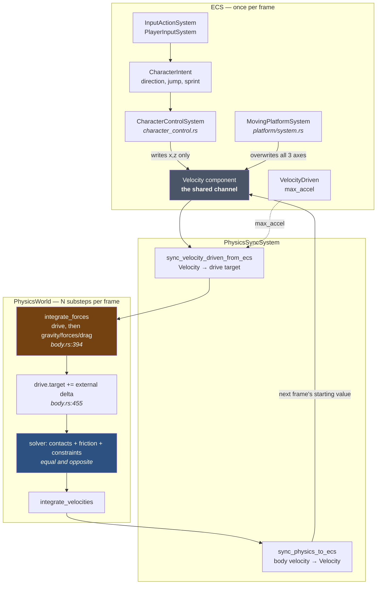
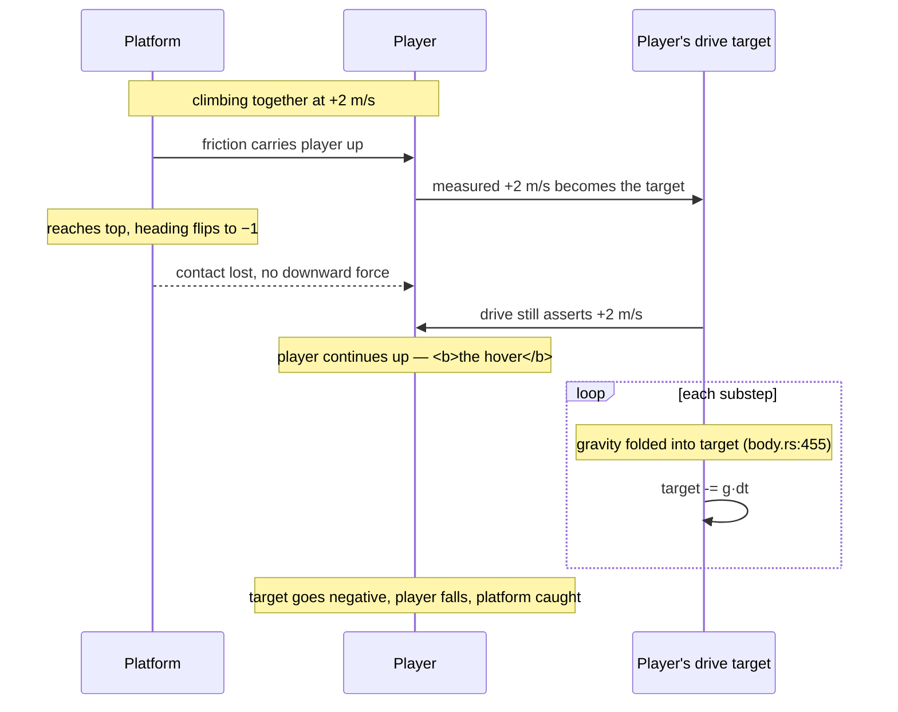
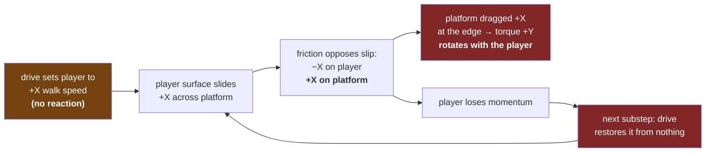

# Velocity Drive and Moving Platforms

How a player riding a powered platform actually works in this engine, why the
ride is smooth, and why walking along the platform's edge spins it the wrong
way.

The short version: **`VelocityDriven` is a reactionless external momentum
source.** Every behaviour described below follows from that one fact.

---

## 1. The components



The load-bearing detail is the **loop**: `Velocity` is not an authored command.
It is last frame's *measured* body velocity (`sync_physics_to_ecs`, called at
`physics_sync.rs:333`), which the gameplay systems then partially overwrite
before it is handed back down as this frame's drive target.

Who writes what into that channel differs, and this is the whole story:

| Writer | Axes written | Effect |
|---|---|---|
| `CharacterControlSystem` via `apply_movement_rule` (`character_control.rs:366`) | **x and z only** | steers horizontal velocity toward walk speed at `ground_accel`; **y passes through untouched** except on jump/cutoff |
| `MovingPlatformSystem` (`platform/system.rs`) | **all three** | overwrites with `axis * speed * heading` every frame |

---

## 2. Why the ride works (and why I predicted it wouldn't)

I claimed the player would slide off because the drive target is world-space and
would brake against the carry. That is wrong for a **vertical** lift, for a
reason visible in `apply_movement_rule`:

```rust
vel.0.x = move_toward(vel.0.x, rule.target.x, max_delta);
vel.0.z = move_toward(vel.0.z, rule.target.z, max_delta);
// vel.0.y is never touched here
```

Two things save the ride:

1. **`vel.0` starts as the measured body velocity**, not zero. It is a
   *modification* of reality, not a command issued in ignorance of it.
2. **The vertical axis is never modified.** So the drive target's `y` is
   literally "keep doing what you are already doing vertically".

Friction from the platform lifts the player; that velocity is written back into
`Velocity`; next frame it becomes the player's own drive target. The drive
therefore *ratifies* the carry rather than fighting it. No frame-tracking code
is needed, and none exists.

The hover at the top falls out of the same mechanism plus `body.rs:455`:



The "hover" is not a bug and not a special case. It is the player's drive target
holding the last velocity it measured, while `body.rs:455` bleeds gravity into
that target one substep at a time until it goes negative.

**What is genuinely untested:** a *horizontal* platform. There, `x` and `z` are
overwritten toward the walk target (zero when idle) at `ground_accel`, so the
drive really would brake against the carry. The vertical case is safe precisely
because it is the one axis gameplay does not touch. This is a prediction, not a
measurement — `levels/test_arena.level.ron` now carries a horizontal run at
z = −18 to settle it.

---

## 3. Why walking the edge spins the platform the wrong way

### What the engine does

`integrate_forces` applies the drive **directly to one body's velocity, with no
reaction partner** (`body.rs:400`):

```rust
if let Some(drive) = &self.velocity_drive {
    let delta = drive.target - self.linear_velocity;
    let max_delta = drive.max_accel * dt;
    self.linear_velocity += delta * (max_delta / delta_mag).min(1.0);
}
```

Nothing anywhere receives an equal and opposite impulse. The player accelerates
because an invisible hand outside the physical system pushes them.

Friction then does its job correctly, which is what makes the result wrong:



The player is behaving as a **conveyor belt**, not a walker: a surface held at
constant velocity by an external agency, dragging whatever it touches along with
it. A conveyor drags its load *forwards*. That is exactly the rotation observed.

### What conservation demands

For an isolated player-plus-platform system, the player's momentum must come
*from* the platform. The platform pushes the player `+X`; the reaction on the
platform is `−X`; applied at the `+Z` edge that is a `−Y` torque — the platform
rotates **opposite** to the player's motion, and the two centres of mass stay
put. That is the expectation, and it is correct.

### Why the sign flips

The engine does not get friction backwards. It gets the *momentum source*
backwards. Real walking:

```
player momentum ← friction ← platform     (platform recoils: −X)
```

This engine:

```
player momentum ← drive ← nowhere
platform momentum ← friction ← player     (platform dragged: +X)
```

Friction is still equal and opposite. It is the drive that is not.

### Why the loop never closes

`body.rs:451–460` deliberately folds external effects back into the drive
target so drives do not fight gravity:

```rust
// Shift drive targets by external forces (gravity, accumulated forces,
// drag, torques, gyroscopic correction) so drives don't fight these
// effects across substeps.
drive.target += self.linear_velocity - vel_after_drive;
```

That shift is computed **inside `integrate_forces`**, which runs *before* the
solver. Contact and friction impulses land afterwards, so they are never folded
into the target. The consequence:

- Gravity is absorbed → the drive does not fight it (intended, and what makes
  the lift sag exactly `g · frame_dt`).
- Friction is **not** absorbed → the drive re-asserts the stolen velocity on the
  very next substep.

So friction bills the player every substep and the drive pays the bill from an
infinite account. Momentum flows into the platform continuously and never leaves
the player. This is the pump.

---

## 4. The same defect on the platform's own motor

`MovingPlatformSystem` overwrites all three axes with `axis * speed * heading`
every frame, so the platform's drive target is re-authored from scratch rather
than round-tripped. Its motor is reactionless too: it pushes against nothing,
and a lift carrying a player does not slow down because the load's contact
impulse is not folded into its target either.

The measured `lift_holds_cruise_speed_against_gravity` result (1.8365 m/s
against an authored 2.0) is this system working as designed — the shortfall is
one frame of gravity, and gravity is the *only* thing the target absorbs.

Stalling is still possible but only transiently: the drive can restore at most
`max_accel · dt` per substep, so a load removing more than that stalls the
platform for as long as it keeps doing so. It never loses ground permanently.

---

## 5. State of play

**Implemented and verified**
- Vertical carry of a passenger, including ballistic hover at the reversal.
- Platform patrol, endpoint reversal, cruise speed against gravity.
- Rigid attitude via `KeepUpright` with unlimited authority.

**Implemented, consequences not yet chosen**
- Reactionless linear drive on both player and platform (this document).
- Reactionless *angular* drive: `vd.angular_velocity` at
  `character_control.rs:154` turns the player with the same no-partner
  mechanism.
- Free yaw on the platform — `KeepUpright` locks only the two tilt axes.

**Not implemented**
- Any reaction from a driven body onto what it is standing on.
- Horizontal-platform carry (see §2) — authored and awaiting play-test.

The platform's route is now a servo rather than a heading: cruise along the leg
at `speed`, plus a proportional correction across it. That closes the gravity
sag a horizontal run would otherwise suffer — the drive is a velocity source, so
gravity is a *velocity* disturbance of `g · frame_dt`, and a proportional
correction leaves it standing at that over `route_gain`, measured at 10 mm.

---

## 6. Where a fix would live

Recorded for later; no code yet.

The minimal honest change is to make the drive **spend its impulse against the
supporting body** rather than against the world: when a driven body is in
contact, apply `−Δp` to the contact partner, distributed at the contact points
so it produces the right torque. That converts the drive from a velocity source
into something closer to a real actuator, and the edge-walking rotation flips to
the correct sign by construction.

The obvious cheap alternative — folding contact impulses into the drive target
alongside gravity at `body.rs:455` — is a trap. It would stop the pump, but it
would also make the player's drive surrender to *every* contact, including the
ground they are trying to walk on, so walking would stop working entirely.

Note the interaction with `sensing/probe` and grounding: whatever receives the
reaction must be the body actually supporting the character, which is
information the probe already computes.
